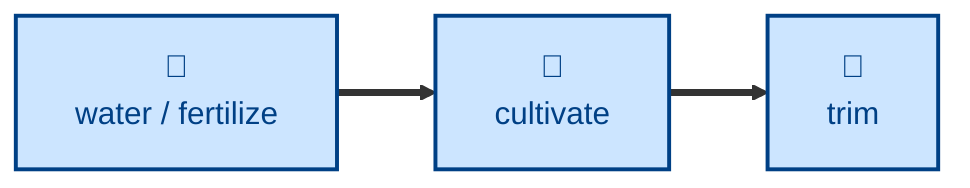

# Cultivate

Reviews a single entry against
[docs/style-guide.md](../../../docs/style-guide.md) and fixes mechanical style
violations directly.

The agent re-reads the style guide, then checks titles and headings, written
style (sentence length, dashes, colons), bold-text usage, and admonition usage
on the target entry. Mechanical fixes — wrong dash character, hyphen-separated
list terms, wrong-case headings, stray bold, an unbolded `xref:` — are applied
in place. Sentence-level rewrites and bolding judgment calls are proposed in
the report for you to decide.

## Interactivity

Non-interactive. The agent reviews, fixes what is mechanical, and reports the
rest without blocking for input, so it is safe to run away from the keyboard.
Every change is left uncommitted in the Git working tree — reviewing the diff
is how you approve it.

## How to invoke

> Cultivate resilience.adoc.

> Check style on this entry.

> Give agent.adoc a style-guide pass.

## Recommended models

A mid-tier model is sufficient. The fixes are mechanical and the guide is read
fresh each run; the genuinely hard calls are flagged rather than made.

## Suggested workflows

Run on one entry at a time, after any pass that has added or rewritten prose.
Running it across the whole garden in one go is an anti-pattern — the diff
becomes too large to review, which is the only approval gate these skills have.

## Related skills

- [**trim**](../trim/) \
  The freeform counterpart. This skill enforces written rules; trimming makes
  judgment-driven improvements the guide has nothing to say about.

- [**tend**](../tend/) \
  Repairs the structural defects — broken links, orphans, stale labels — that
  this skill reports but refuses to touch.

- [**split**](../split/) \
  Takes the entries this skill flags as having grown past one concept.

- [**water**](../water/) \
  Adds the material this skill then brings into line with the guide. Run them
  in that order, or the style pass is wasted on prose about to be rewritten.

- [**graft**](../graft/) \
  Produces merged prose, stitched from several entries, that usually needs a
  style pass afterwards.

## References

- [Style guide](../../../docs/style-guide.md) \
  The sole authority for what this skill enforces.
