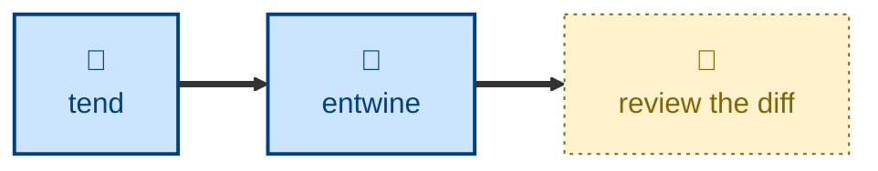

# Entwine

Given a single garden entry, finds other entries related to it but not
cross-referenced, and adds the missing `xref:` links.

The agent takes one target, scans the garden for entries related to it — by
shared index section, by naming its concept without linking it, or by domain
knowledge alone — keeps only the pairs whose connection can be justified in one
line, and adds the links in both directions where each reads naturally. It
never creates entries; gaps that need new content are reported instead.

## Interactivity

Non-interactive. The agent assesses the candidate pairs and links them without
blocking for input, so it is safe to run away from the keyboard. Every change
is left uncommitted in the Git working tree — reviewing the diff, against the
one-line justification given for each link, is how you approve it.

## How to invoke

> Entwine event-sourcing.adoc with its neighbors.

> Link this page to related entries.

> Is retry.adoc properly connected to its siblings?

## Examples

Given "entwine event-sourcing.adoc with its neighbors", a typical report reads:

```
Linked event-sourcing.adoc -> cqrs.adoc
  Commonly paired; cqrs.adoc already linked back.
Linked event-sourcing.adoc <-> event-driven-architecture.adoc
  Parent pattern; neither entry referenced the other.
Rejected event-sourcing.adoc -> audit-log.adoc
  Related only by analogy; too thin to justify in one line.
```

## Recommended models

A premium frontier reasoning model. Deciding which entries are genuinely
related, with no textual hint to go on, is domain judgment — and a weak model
links everything to everything.

## Suggested workflows

Run on an entry that has just been planted or grown, when new connections are
most likely to be missing. A health check first will have converted the
bracketed pseudo-links this skill deliberately leaves alone.



## Related skills

- [**tend**](../tend/) \
  Repairs links that are broken or fake. This skill adds ones that were never
  there.

- [**sow**](../sow/) \
  Plants the entries this skill reports as missing, and does its own linking
  for a brand-new entry.

- [**prune**](../prune/) \
  Hands over the near-duplicate pairs that are better linked than dropped.

## References

- [Style guide](../../../docs/style-guide.md) \
  The bold-text convention every `xref:` must follow.
