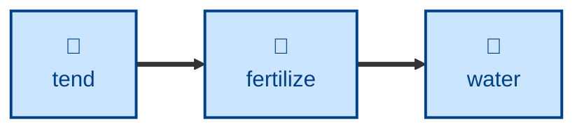

# Fertilize

Brings a thin stub entry up to strength, without changing what it's about.

If you name an entry, the agent expands that one. If you don't, it scans the
garden, ranks the weakest stubs — shortest body, most `// TODO` markers, fewest
cross-references — and works on the top-ranked one, naming the runners-up so
you can redirect it. It researches the topic, resolves the flagged gaps, adds
cross-references, and reports whether the entry's maturity emoji now looks
understated.

## Interactivity

Non-interactive. The agent picks its target and works to completion without
blocking for input, so it is safe to run away from the keyboard. Every change
is left uncommitted in the Git working tree — reviewing the diff is how you
approve it. Maturity emoji are never changed, only recommended.

## How to invoke

> Fertilize the abstraction entry.

> This entry needs more growth.

> Find the weakest stub in the garden and fertilize it.

## Recommended models

A premium frontier reasoning model. Filling a gap well needs both open-ended
research and a firm sense of where the entry's scope ends, and a cheaper model
tends to pad the page rather than deepen it.

## Suggested workflows

Run on the seedlings a garden-health pass or a foraging pass has flagged as
thin. Once the entry is established, later growth is a research-and-extend job
rather than a rescue.

## Related skills

- [**water**](../water/) \
  Grows an entry that is already established. This skill is the rescue case:
  a stub with known gaps.

- [**sow**](../sow/) \
  Plants a topic that has no entry at all. Fertilizing never creates a page.

- [**tend**](../tend/) \
  Surfaces the stubs and stale labels that make good fertilize candidates.

- [**prune**](../prune/) \
  Takes the redirect stubs this skill refuses to expand, and drops them.

## References

- [Style guide](../../../docs/style-guide.md) \
  Writing and AsciiDoc formatting conventions the expanded prose must follow.
