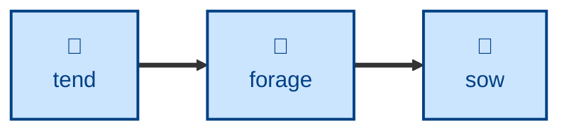

# Forage

Finds topics that are referenced or implied across the garden but have no entry
of their own, and produces a ranked list of candidates worth planting.

The agent scans every entry for bracketed markers (`*[text]*` with no matching
entry) and for plain unmarked mentions of recurring topics, aggregates them by
concept, counts how many entries mention each, and presents a ranked list with
the doubtful candidates flagged.

## Interactivity

Non-interactive, and read-only. The agent never blocks for input and never
writes to the repository, so it is safe to run away from the keyboard and safe
to run on a clean working tree. It reports; you decide what to plant.

## How to invoke

> Forage the garden.

> What topics are missing?

> Forage around the AI topics.

## Examples

Given "forage the garden", a typical report reads:

```
1. accidental complexity (9 entries: microservices, distributed-system, ...)
2. distributed software (8 entries: ...)
3. domain experts (5 entries: ...) — possibly too broad to be atomic
```

## Recommended models

A mid-tier model is sufficient. Steps 1 and 2 are mechanical searching against
a file inventory; only the scope judgment on each candidate needs care, and
doubtful cases are flagged rather than resolved.

## Suggested workflows

Run periodically over the whole garden to decide what to plant next. It pairs
naturally with a health check, which catches the bracketed markers this skill
deliberately excludes — the ones whose entry already exists.



## Related skills

- [**sow**](../sow/) \
  Plants the candidates this skill ranks. Foraging never creates an entry
  itself.

- [**tend**](../tend/) \
  Converts the bracketed markers whose entry already exists, which is exactly
  the set this skill discards.

- [**harvest**](../harvest/) \
  The other read-only survey in the family. Foraging looks at what is missing;
  harvesting looks at what has recently changed.
