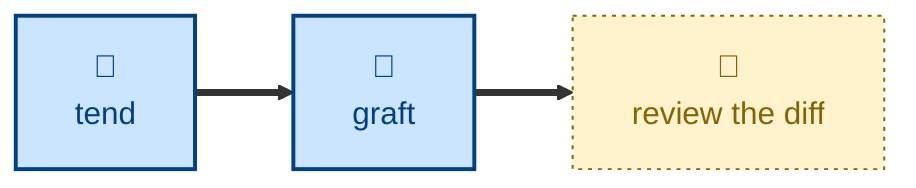

# Graft

Merges two or more related-but-distinct entries into a single broader entry,
repointing cross-references and removing the absorbed files.

Given several entries covering different-but-related ideas, the agent picks the
survivor, maps each source's content onto sections of it, folds them into one
coherent entry, repoints every `xref:`, updates the index and nav, and deletes
what was absorbed. If one source adds nothing the others lack, it's left out of
the graft and reported as something to drop instead.

## Interactivity

Non-interactive. The agent plans the merge and carries it out without blocking
for input, so it is safe to run away from the keyboard. The deletions are left
uncommitted in the Git working tree along with everything else, so a merge you
don't like is undone with `git restore` — reviewing the diff is how you approve
it. The merge plan is reported so you can check the diff against it.

## How to invoke

> Graft retry.adoc, backoff.adoc and jitter.adoc into one retry-strategies page.

> These three entries really cover one theme — merge them.

> Merge backoff.adoc into retry.adoc.

## Recommended models

A premium frontier reasoning model. Deciding what counts as one concept, and
rewriting several entries into a page that reads as one, is the hardest
judgment call in the family — and it deletes files if it gets it wrong.

## Suggested workflows

Run when a health check or a foraging pass surfaces a cluster of thin entries
circling one idea. Follow it with a health check, to confirm nothing still
points at an absorbed file.

## Related skills

- [**split**](../split/) \
  The inverse. Splitting breaks one entry into several; this skill merges
  several into one.

- [**prune**](../prune/) \
  Drops an entry that adds nothing, which is what this skill hands over
  whenever a source turns out to be redundant rather than distinct.

- [**tend**](../tend/) \
  Reports the same-topic clusters worth merging, and afterwards confirms no
  link still points at an absorbed entry.

- [**cultivate**](../cultivate/) \
  Brings the merged prose back into line with the style guide.

## References

- [Style guide](../../../docs/style-guide.md) \
  Writing and AsciiDoc formatting conventions the merged entry must follow.
