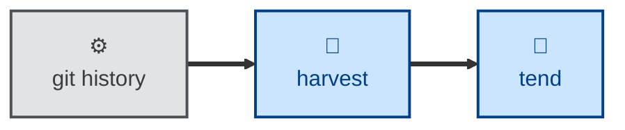

# Harvest

Produces a digest of recent garden activity — what's been sown, watered,
fertilized, tended, pruned, grafted, split, entwined, cultivated, trimmed,
weeded, or uprooted — without re-scanning the whole repository.

The agent reads the `git log` for a given window (or since the last saved
digest), classifies each commit by its type prefix, falls back to the diff
wherever the prefix is missing, legacy, or mismatched, and reports a grouped
digest. Most of this repository's history predates the current commit types, so
the fallback does real work on any long window.

## Interactivity

Non-interactive. The agent works from the Git history alone and never blocks
for input, so it is safe to run away from the keyboard. It is read-only by
default; it writes a digest file only if you ask, and never stages or commits
it.

## How to invoke

> Harvest the garden.

> What's changed in the garden over the last two weeks?

> Harvest since v1.4, and save the digest.

## Recommended models

A mid-tier model is sufficient. Reading a commit log and grouping it is
mechanical; the only real judgment is classifying a legacy commit from its
diff, which the skill spells out signature by signature.

## Suggested workflows

Run at the end of a working session, or before writing up what changed over a
period. Anything broken that the digest surfaces goes to a health check rather
than being fixed inline.

## Related skills

- [**forage**](../forage/) \
  The other read-only survey in the family. Harvesting looks at what has
  recently changed; foraging looks at what is missing.

- [**tend**](../tend/) \
  Repairs the half-finished changes a digest surfaces, which this skill only
  names.

## References

- [Contributing guide](../../../CONTRIBUTING.md) \
  The list of commit types this skill classifies by, and the authority
  whenever the two disagree.
