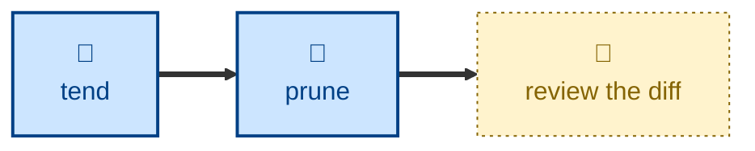

# Prune

Drops an entry whose topic is already well covered by another, deleting it and
redirecting its links to the covering entry.

Given one target, the agent finds the entry that already covers its topic,
confirms the target is genuinely redundant, salvages any stray scrap, repoints
every reference, removes the index and nav listings, and deletes the file. If
the target actually carries distinct content, nothing is deleted — the agent
reports it as a merge or linking candidate instead.

## Interactivity

Non-interactive. The agent decides and acts without blocking for input, so it
is safe to run away from the keyboard. The deletion is left uncommitted in the
Git working tree along with everything else, so a wrong drop is undone with
`git restore` — reviewing the diff is how you approve it.

## How to invoke

> Prune acid.adoc — it's already covered by acid-principles.adoc.

> This entry is redundant, drop it.

> Is circuit-breaker.adoc made redundant by resilience.adoc?

## Recommended models

A premium frontier reasoning model. The load-bearing decision is whether one
entry truly says everything another does, and a model that gets that wrong
deletes content.

## Suggested workflows

Run when a health check or a foraging pass surfaces two entries on the same
topic. Follow it with a health check, to confirm nothing anywhere still points
at the dropped file.

## Related skills

- [**graft**](../graft/) \
  Merges entries that each carry distinct content. This skill only drops one
  that carries none, and hands the rest over.

- [**entwine**](../entwine/) \
  Links two entries that overlap but are both worth keeping — the outcome
  whenever this skill decides not to drop.

- [**tend**](../tend/) \
  Reports same-topic duplicates without acting on them, and afterwards
  confirms no link still points at the dropped entry.

- [**fertilize**](../fertilize/) \
  Hands over the redirect stubs it refuses to expand, which are this skill's
  cleanest candidates.

- [**split**](../split/) \
  Checks for an existing entry before creating one, precisely so this skill
  does not have to drop the duplicate later.
