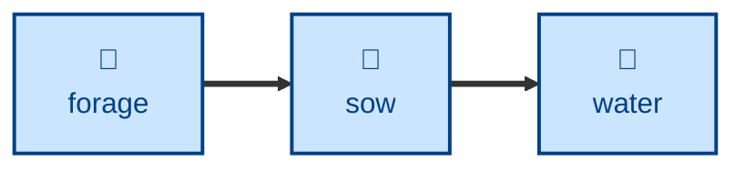

# Sow

Plants a brand-new entry in the digital garden — researching a topic, writing
an atomic AsciiDoc page, and cross-referencing it to relevant adjacent entries
already in the garden.

Given a topic, the agent checks it doesn't already exist, researches it, writes
a focused `.adoc` file under `src/modules/ROOT/pages/`, links it to and from
related entries, and lists it in `index.adoc` (marked 🌱 Seedling) and
`nav.adoc` at matching alphabetical positions.

## Interactivity

Non-interactive. The agent works from the topic it was given and the garden
itself, and never blocks for input, so it is safe to run away from the
keyboard. Every change is left uncommitted in the Git working tree — reviewing
the diff is how you approve it.

## How to invoke

> Sow a new entry for event sourcing.

> Plant a page on the circuit breaker pattern.

> Add a topic to the garden for consistent hashing.

## Recommended models

A premium frontier reasoning model. Sowing is open-ended research plus a
judgment call about whether the topic is atomic enough to deserve its own
page, and a weak model tends to plant near-duplicates.

## Suggested workflows

Run after a foraging pass has identified which gaps are worth filling, so the
topic is one the garden actually needs. An entry sown today is a seedling; run
a research-and-extend pass on it later, once it has settled.

## Related skills

- [**forage**](../forage/) \
  Produces the ranked list of missing topics that this skill then plants. It
  never creates a page itself.

- [**water**](../water/) \
  Grows an entry that already exists, by researching its topic afresh. Use it
  in place of this skill when the page is already there.

- [**fertilize**](../fertilize/) \
  Rescues a thin stub. A freshly sown entry that came out slight is a
  fertilize candidate, not a re-sow.

- [**entwine**](../entwine/) \
  Does the cross-referencing job on its own, for an entry that was sown
  without enough links into its neighborhood.

- [**split**](../split/) \
  Applies the same atomicity criterion to each concept it lifts out of an
  overgrown entry, and plants the results the same way.

## References

- [Style guide](../../../docs/style-guide.md) \
  Writing and AsciiDoc formatting conventions every new entry must follow.
