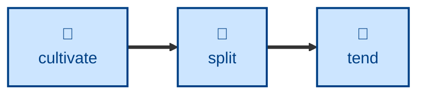

# Split

Breaks up an overgrown entry that covers more than one concept into separate
cross-referenced entries.

Given an entry that's drifted into covering several ideas, the agent plans the
split, checks each concept would really be linked from more than one place,
checks it doesn't already have an entry elsewhere, creates a new atomic entry
per concept extracted, narrows the original, and links everything together.

## Interactivity

Non-interactive. The agent plans the split and carries it out without blocking
for input, so it is safe to run away from the keyboard. Every change is left
uncommitted in the Git working tree — reviewing the diff is how you approve it.
The split plan is reported so you can check the diff against it.

## How to invoke

> Split event-driven-architecture.adoc — it's covering both event sourcing and CQRS.

> This entry has grown to cover two ideas, split it.

> Break resilience.adoc up into its patterns.

## Recommended models

A premium frontier reasoning model. Judging where one concept ends and another
begins, and rewriting lifted content so it stands alone, both degrade sharply
on a cheaper model.

## Suggested workflows

Run when a style or trim pass reports that an entry has grown past one concept.
Follow it with a health check, so the new entries' listings and links are
verified.

## Related skills

- [**graft**](../graft/) \
  The inverse. This skill breaks one entry into several; grafting merges
  several into one.

- [**sow**](../sow/) \
  Plants an entry from scratch, under the same atomicity criterion this skill
  applies to each concept it extracts.

- [**prune**](../prune/) \
  Drops the near-duplicates a careless split would create, which is why this
  skill checks for an existing entry first.

- [**cultivate**](../cultivate/) \
  Flags the overgrown entries that make good split candidates, and afterwards
  brings the new entries' prose into line with the style guide.

- [**water**](../water/) \
  Hands over an entry whose research surfaced a second concept, and afterwards
  grows the narrowed original back up.

- [**trim**](../trim/) \
  Hands over the stray paragraphs that belong on an entry of their own, which
  it reports rather than moves.

## References

- [Style guide](../../../docs/style-guide.md) \
  Writing and AsciiDoc formatting conventions each new entry must follow.
