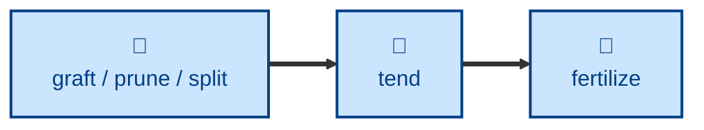

# Tend

Walks the digital garden looking for withering content: broken
cross-references, fake pseudo-links, entries missing from the index or nav, and
maturity emoji that no longer match reality.

The agent inventories every entry, checks all `xref:` targets resolve, finds
bracketed text that looks like a link but isn't real AsciiDoc syntax, finds
entries absent from `index.adoc` or `nav.adoc`, and flags maturity emoji that
look out of date. Unambiguous fixes — a clear rename, a pseudo-link with an
obvious real target — are applied directly. Everything else is reported.

## Interactivity

Non-interactive. The agent inspects, fixes what is mechanical, and reports the
rest without blocking for input, so it is safe to run away from the keyboard.
Every change is left uncommitted in the Git working tree — reviewing the diff
is how you approve it. Maturity emoji are never changed, only recommended.

## How to invoke

> Tend the garden.

> Check for broken links.

> Tend the AI topics.

## Recommended models

A mid-tier model is sufficient. Most of the work is mechanical
cross-checking against a file inventory; the only judgment calls are handed
back rather than resolved.

## Suggested workflows

Run periodically over the whole garden, and after any change that renames,
merges, or removes entries — those are what leave dead links behind. The
stubs and stale labels it reports feed the rescue and style passes.

## Related skills

- [**cultivate**](../cultivate/) \
  The style-guide counterpart. This skill repairs structure — links, listings,
  labels; cultivating fixes how the prose is written.

- [**entwine**](../entwine/) \
  Adds cross-references that were never there. This skill only repairs ones
  that are broken or fake.

- [**forage**](../forage/) \
  Takes the bracketed terms this skill reports as having no matching entry,
  and ranks them as candidates worth planting.

- [**fertilize**](../fertilize/) \
  Rescues the thin stubs this skill flags through their stale maturity emoji.

- [**prune**](../prune/) \
  Drops one of the same-topic duplicates this skill reports but never resolves.

- [**graft**](../graft/) \
  Merges the clusters of near-duplicate entries this skill surfaces. Run this
  skill again afterwards, to confirm no link points at an absorbed entry.

- [**harvest**](../harvest/) \
  Names the half-finished changes in recent history that this skill then
  repairs.

## References

- [Antora navigation files](https://docs.antora.org/antora/latest/navigation/files-and-lists/) \
  Why an entry missing from `nav.adoc` renders with no breadcrumb trail.
