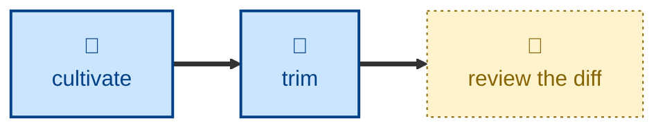

# Trim

Everyday gardening — a freeform, judgment-driven pass over one entry in the
garden.

The agent makes small, self-evidently-good edits directly: cutting waffle,
smoothing awkward phrasing, dropping repetition, merging stray sentences, and
moving a paragraph somewhere it sits better. It changes how the entry reads,
never what it says. This is the secateurs work that keeps the garden trim.

## Interactivity

Non-interactive. The agent edits and reports without blocking for input, so it
is safe to run away from the keyboard. Every change is left uncommitted in the
Git working tree — reviewing the diff is how you approve it.

## How to invoke

> Trim agent.adoc.

> Give this page a once-over — trim the waffle and move things about.

> Trim the section on AI agents.

## Recommended models

A premium frontier reasoning model. Every edit here is a judgment call about
whether a change is self-evidently an improvement and whether it moves the
meaning, and there is no rulebook to fall back on.

## Suggested workflows

Run last, after the content passes have added material and the style pass has
applied the guide. Trimming first only means trimming prose that is about to
be rewritten.

## Related skills

- [**cultivate**](../cultivate/) \
  The rule-driven counterpart. Cultivating enforces the written style guide;
  this skill handles everything the guide has nothing to say about.

- [**water**](../water/) \
  Adds material. This skill only removes and rearranges what is already
  there.

- [**split**](../split/) \
  Takes the entries whose stray paragraphs really belong on a page of their
  own, which this skill reports rather than moves.

## References

- [Style guide](../../../docs/style-guide.md) \
  Background on the garden's writing conventions. This skill does not enforce
  them, but should not work against them either.
