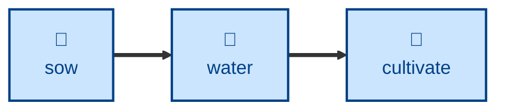

# Water

Researches an established entry's topic afresh and extends the page with new
material — like sowing, but for a page that already exists.

The agent reads the entry, researches the topic for depth and developments
beyond what's already there, extends the page in place while staying on the
same concept, adds cross-references in both directions, and reports whether the
entry's maturity emoji now looks understated.

## Interactivity

Non-interactive. The agent works from the named entry and the garden itself,
and never blocks for input, so it is safe to run away from the keyboard. Every
change is left uncommitted in the Git working tree — reviewing the diff is how
you approve it. Maturity emoji are never changed, only recommended.

## How to invoke

> Water event-sourcing.adoc.

> Research and extend the resilience entry.

> Grow the CQRS page with more depth, especially the trade-offs.

## Recommended models

A premium frontier reasoning model. The work is open-ended research plus a
judgment call about what counts as the same concept, and both degrade sharply
on a cheaper model.

## Suggested workflows

Run on entries that have settled — sown a while ago, already substantial, and
now behind the state of the art. Watering the same entry every week is an
anti-pattern; there is only so much depth one concept carries.

## Related skills

- [**sow**](../sow/) \
  Plants a topic that has no entry yet. Use it instead of this skill when
  there is nothing to grow.

- [**fertilize**](../fertilize/) \
  Rescues a thin stub with known gaps. This skill grows an entry that is
  already established; fertilizing brings a weak one up to strength.

- [**split**](../split/) \
  Breaks up an entry that has outgrown one concept. Watering hands off to it
  when research surfaces a second idea.

- [**cultivate**](../cultivate/) \
  Brings the extended prose back into line with the style guide.

- [**trim**](../trim/) \
  Tightens what this skill added. Growing an entry and then trimming it is the
  usual pairing; trimming first only trims prose about to change.

## References

- [Style guide](../../../docs/style-guide.md) \
  Writing and AsciiDoc formatting conventions the extended prose must follow.
