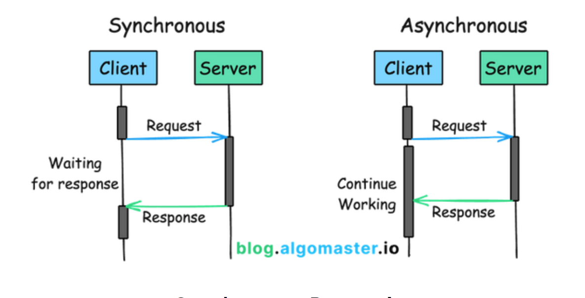

= Asynchronous communication

*link:./synchronous-communication.adoc[Synchronous]* and asynchronous communication are two approaches to *interaction* in software design. Each approach has its own advantages and disadvantages, and each has different use cases.

In asynchronous communication (aka. *asynchronous messaging*), the sender and receiver do not interact in real-time. The sender may or may not expect a response from the receiver. But if it does, the sender can continue with other tasks while waiting for the response. The interaction is therefore said to be *non-blocking*.

Asynchronous communication is often used in *link:./distributed-system.adoc[distributed software]*, and typically implemented using *link:./message-driven-architecture.adoc[message-driven]* or *link:./event-driven-architecture.adoc[event-driven]* architectural patterns to *link:./asynchronous-processing.adoc[distribute processing]* across multiple nodes. Asynchronous communication increases the *[fault tolerance]* of distributed systems by decreasing *temporal coupling* between nodes. Temporal coupling is a form of *coupling* where one service is dependent on the _immediate availability_ of another service. Removing temporal coupling using asynchronous, *[message-driven]* communication patterns reduces the risk of *cascading failures*, where a drop in performance or outright failure in one component causes a chain reaction of failures in other components. Reducing temporal coupling between services solves the problem of each service and network call being a potential *[point of failure]*, so improving the *[fault tolerance]* of the overall system.

Asynchronous communication patterns have a number of other advantages in the context of distributed software systems. For example, responsibility for the implementation of *[retries]* and *[circuit breakers]* can be offloaded from domain services to dedicated infrastructure such as *[message queues]*, reducing the *[accidental complexity]* of individual services (but at the cost of increasing the accidental complexity of the overall system). Message-driven communication patterns also better support *[evolutionary]* *[microservice]* designs, because the system is less likely to incrementally degrade into "API hell" where the number of direct service-to-service calls becomes unmanageable and where anti-patterns like *[circular service calls]* may emerge.

Asynchronous communication should not be confused with *link:./asynchronous-programming.adoc[asynchronous programming]*, which is a programming paradigm that allows for non-blocking execution of tasks using *link:./concurrency.adoc[concurrent]* or *link:./parallelism.adoc[parallel]* processing, and implemented using constructs such as promises and callbacks.
