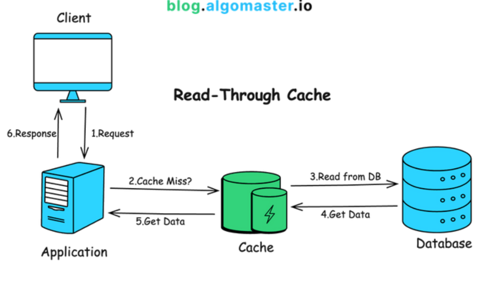
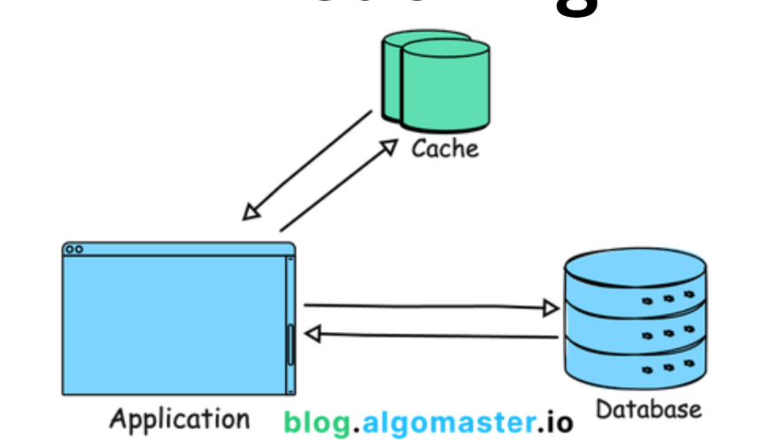

= Caching

// TODO: https://medium.com/must-know-computer-science/system-design-caching-acbd1b02ca01
// TODO: https://blog.algomaster.io/p/4d7d6f8a-6803-4c7b-85ca-864c87c2cbf2
// TODO: https://blog.algomaster.io/p/59cae60d-9717-4e20-a59e-759e370db4e5
// TODO: https://blog.algomaster.io/p/top-5-caching-strategies-explained
// TODO: https://www.geeksforgeeks.org/system-design/caching-system-design-concept-for-beginners/
// TODO: https://newsletter.systemdesign.one/p/caching-patterns

Caching is a technique used to temporarily store copies of data and other artifacts in *high-speed* storage layers, to reduce the time taken to access the data.

The primary goal of caching is to improve system *[performance]*. Other benefits include higher *link:./availability.adoc[availability]*, and *link:./scalability.adoc[scalability]*.

These benefits are achieved by reducing *[latency]* (for example by using technologies that are more highly optimized for fast data retrieval than the main data store), and increasing *[throughput]* (for example by offloading some requests from the main data store).

Caching is most beneficial for frequently-accessed data that does not change often, or that is expensive to retrieve (for example where retrieval requires expensive joins or calculations).

== Cache types

Caching can be implemented at multiple levels of a system, and using different technologies. Examples include but are not limited to:

* *In-memory caching*: Storing data in memory, which is faster to access than reading from disk.

* *Database caching*: Storing the results of database queries in memory, to avoid having to re-run the same query.

* *link:./content-delivery-networks.adoc[Content delivery networks (CDNs)]*: Geographically distributed networks of caches that store copies of data closer to end-users, reducing latency and bandwidth costs. CDNs are particularly useful for caching large static assets, such as images, videos, and JavaScript programs.

* *Client-side caching*: Any caching that happens on the client side, such as in a web browser, reducing the number of duplicate server requests from individual clients.

== Caching strategies (aka. cache invalidation strategies)

[quote, Phil Karlton]
____
There are only two hard things in Computer Science: cache invalidation and naming things.
____

Caching comes with its own sets of challenges. The main difficulty is maintaining data *link:./consistency.adoc[consistency]*. When data changes in the source-of-truth, the cached copies become stale. There are various strategies that can be implemented to maintain consistency between sources and caches. Caching strategies include:

* *Read-through*: Automatically fetches data from the source-of-truth when it is requested and when the cache is empty or stale (a "cache miss"), backfilling the cache. +
+

* *Write-through*: Data is written to the cache and the source-of-truth at the same time. This ensures that the cache is always up-to-date, but it can introduce latency in write operations.

// TODO: Add diagram for write-through cache

* *Write-back*: Data is written to the cache first, and then asynchronously written to the source-of-truth storage. This reduces write latency, but it can introduce the risk of data loss if the cache fails before the data is written to the source-of-truth.

// TODO: Add diagram for write-back cache.

* *Write-around*: Data is written directly to the source-of-truth, bypassing the cache. This increases read latency for new data, but it avoids filling the cache with data that may not be accessed again. This is a good technique for infrequently-accessed data.

// TODO: Must write-around be usd in conjunction with read-through?

* *Cache-aside*: This is a common caching strategy, and it involve the application code managing both data retrieval and caching. This allows for more nuanced control over the cache. Different caching strategies may be implemented for different data types. The trade-off is increased *[accidental complexity]* in the application code. +
+

== Cache eviction policies

When a cache system reaches its capacity, it needs to decide which items to remove to make space for new data. This is known as cache eviction, and there are several possible approaches:

* *Least recently used (LRU)*: Evicts the items that haven't been accessed for the longest time.

* *Least frequently used (LFU)*: Evicts the items with the lowest access rates over time.

* *First in, first out (FIFO)*: Evicts the oldest items first.

* *Time-to-live (TTL)*: Automatically evicts items after a predefined expiry time.

== Cache errors

Caches can go wrong in a number of ways. Four common cache errors are:

* *Thunder herd problem*: This happens when a large number of keys in a cache expire at the same time, and the source-of-truth is subsequently overloaded with requests. This issue can be mitigated by adding randomness to the expiry times of cache keys.

* *Cache penetration*: This happens when a requested key does not exist in neither the cache nor the database, and therefore the application cannot retrieve the relevant data from any source. One possible mitigation strategy is to use a *[bloom filter]* to check for the key's existence. If the key does not exist, we can avoid querying the database.

* *Cache breakdown*: This is similar to the thunder herd problem. It happens when a *[hot key]* (something that accounts for a large proportion of overall requests) expires. A large number of concurrent requests may then hit the source-of-truth before the cache is updated. This issue can can be mitigated by removing expiry times for hot keys, and instead using a pre-fetching strategy to keep hot key caches updated.

* *Cache crash*: This happens when a cache is overwhelmed by requests, and it crashes. This can be mitigated by using a *[circuit breaker]* to temporarily stop requests to the cache, giving it time to recover. Risks of cache crashes can be reduced by improving availability through cache *link:./replication.adoc[replication]*.
