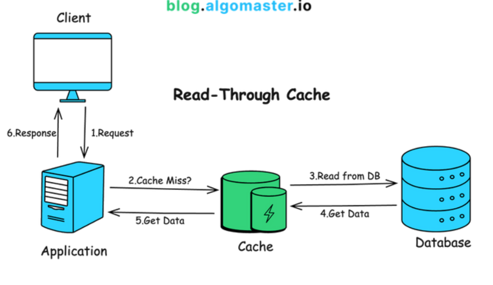
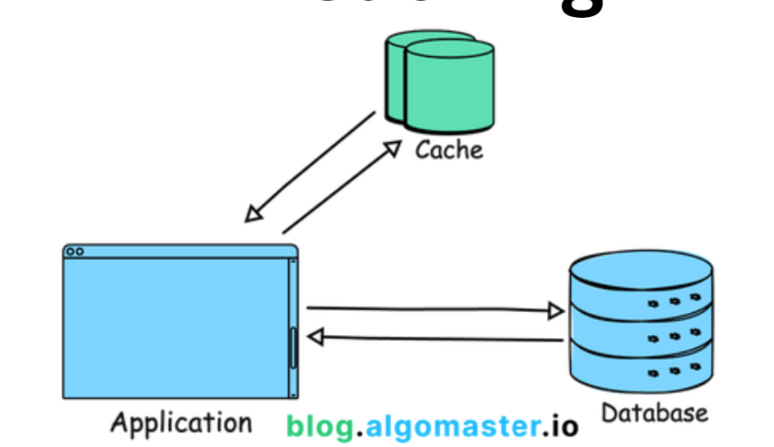

= Caching

Caching is a technique used to temporarily store copies of data and other artifacts in *high-speed* storage layers, to reduce the time taken to access the data.

The primary goal of caching is to improve system *[performance]*. Other benefits include higher *link:./availability.adoc[availability]*, and *link:./scalability.adoc[scalability]*.

These benefits are achieved by reducing *[latency]* (for example by using technologies that are more highly optimized for fast data retrieval than the main data store), and increasing *[throughput]* (for example by offloading some requests from the main data store).

Caching is most beneficial for frequently-accessed data that does not change often, or that is expensive to retrieve (for example where retrieval requires expensive joins or calculations).

The two most popular cache implementations are https://redis.io/[Redis] and https://memcached.org/[Memcached].

== Cache types

Caching can be implemented at multiple levels of a system, and using different technologies. Examples include but are not limited to:

* *In-memory caching*: Storing data in memory, which is faster to access than reading from disk.

* *Database caching*: Storing the results of database queries in memory, to avoid having to re-run the same query.

* *link:./content-delivery-networks.adoc[Content delivery networks (CDNs)]*: Geographically distributed networks of caches that store copies of data closer to end-users, reducing latency and bandwidth costs. CDNs are particularly useful for caching large static assets, such as images, videos, and JavaScript programs.

* *Client-side caching*: Any caching that happens on the client side, such as in a web browser, reducing the number of duplicate server requests from individual clients.

* *Global cache*: A single shared cache space used by all application nodes. This simplifies cache management but can become a bottleneck as the number of clients and requests increases.

* *Distributed cache*: The cache is partitioned across multiple nodes using a *link:./consistent-hashing.adoc[consistent hashing]* function. Each node owns a portion of the cached data, and requests are routed to the appropriate node. This scales well, but a missing node can lead to cache loss (mitigated by storing data on multiple nodes).

== Caching strategies (aka. cache invalidation strategies)

[quote, Phil Karlton]
____
There are only two hard things in Computer Science: cache invalidation and naming things.
____

Caching comes with its own sets of challenges. The main difficulty is maintaining data *link:./consistency.adoc[consistency]*. When data changes in the source-of-truth, the cached copies become stale. There are various strategies that can be implemented to maintain consistency between sources and caches. Caching strategies include:

* *Read-through*: The cache sits between the application and the source-of-truth. All reads go through the cache. On a cache miss, the cache itself fetches data from the source-of-truth, backfills, and returns the result to the application. The application does not interact with the database directly. This offers low read latency but risks data inconsistency. Best suited for read-heavy workloads, such as newsfeeds or product catalogs. +
+

* *Write-through*: The application writes data to the cache, and the cache synchronously writes through to the source-of-truth. This ensures strong consistency between the cache and the database, but introduces higher write latency. Cache space may also be wasted with infrequently accessed data. Best suited for workloads with low write rates where data freshness is critical.

// TODO: Add diagram for write-through cache

* *Write-back*: The application writes data to the cache, and the cache asynchronously writes it to the source-of-truth in batches. This offers better write performance through batching, but introduces the risk of data loss if the cache fails before the data is persisted. Best suited for write-heavy workloads where throughput is more important than durability.

// TODO: Add diagram for write-back cache.

* *Write-around*: Data is written directly to the source-of-truth, bypassing the cache. Subsequent reads that miss the cache are fetched from the source-of-truth and used to backfill the cache. This avoids filling the cache with data that may not be accessed again, but increases read latency for recently-written data. Best suited for large data objects that are updated infrequently.

* *Cache-aside (aka. lazy loading)*: This is a common caching strategy in which the application manages both the cache and the database directly. On a read, the application first checks the cache; on a miss, it reads from the database and writes the result to the cache. This allows for more nuanced control, as different caching strategies may be implemented for different data types. The trade-off is increased *[accidental complexity]* in the application code. Best suited for read-heavy workloads, such as configuration data or user profiles. +
+

These strategies can be combined. For example, read-through can be paired with write-around for write-heavy systems where written data is not immediately read, or with write-back for systems that need both fast reads and fast writes.

== Cache eviction policies

When a cache system reaches its capacity, it needs to decide which items to remove to make space for new data. This is known as cache eviction, and there are several possible approaches:

* *Least recently used (LRU)*: Evicts the items that haven't been accessed for the longest time.

* *Least frequently used (LFU)*: Evicts the items with the lowest access rates over time.

* *First in, first out (FIFO)*: Evicts the oldest items first.

* *Last in, first out (LIFO)*: Evicts the most recently added items first, regardless of access frequency.

* *Most recently used (MRU)*: Evicts the most recently accessed items first. Useful when older items are more likely to be accessed again.

* *Random replacement (RR)*: Randomly selects a cached item to evict. Simple to implement but unpredictable.

* *Time-to-live (TTL)*: Automatically evicts items after a predefined expiry time.

== Cache errors

Caches can go wrong in a number of ways. Four common cache errors are:

* *Thunder herd problem*: This happens when a large number of keys in a cache expire at the same time, and the source-of-truth is subsequently overloaded with requests. This issue can be mitigated by adding randomness to the expiry times of cache keys.

* *Cache penetration*: This happens when a requested key does not exist in either the cache or the database, and therefore the application cannot retrieve the relevant data from any source. One possible mitigation strategy is to use a *[bloom filter]* to check for the key's existence. If the key does not exist, we can avoid querying the database.

* *Cache breakdown*: This is similar to the thunder herd problem. It happens when a *[hot key]* (something that accounts for a large proportion of overall requests) expires. A large number of concurrent requests may then hit the source-of-truth before the cache is updated. This issue can be mitigated by removing expiry times for hot keys, and instead using a pre-fetching strategy to keep hot key caches updated.

* *Cold start*: This happens when a cache is empty, such as after a system restart, and all requests must be served from the source-of-truth until the cache is populated. This can be mitigated by *cache warming* — preloading essential or frequently-accessed data into the cache before the system begins serving traffic.

* *Cache crash*: This happens when a cache is overwhelmed by requests, and it crashes. This can be mitigated by using a *[circuit breaker]* to temporarily stop requests to the cache, giving it time to recover. Risks of cache crashes can be reduced by improving availability through cache *link:./replication.adoc[replication]*.
