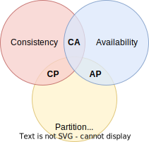
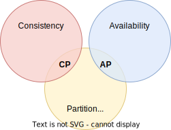

= CAP theorem

The CAP theorem is a useful principle to help us think about some of the core
trade-offs to be made in the design of *link:./distributed-systems.adoc[distributed systems]*.

When dealing with distributed systems in which we need to share data between
multiple nodes, we need to think about:

* How to keep the data consistent between the nodes.
* How to make sure data is always available.

In practice, we can't always have both. We must prioritize one over the other.

The reason is explained in the CAP theorem, which was devised by computer
scientist *Eric Brewer* (CAP theorem is also known as *Brewer's theorem*). The
CAP abbreviation describes the following characteristics of a distributed system:

* *link:./consistency.adoc[Consistency]*: All nodes see the same data at the same time. When a write is
  performed on one node, it is instantly reflected on all other nodes before
  the write is considered complete.

* *link:./availability.adoc[Availability]*: Each request received by a working node must receive a
  response. The system remains operational at all times, and can therefore
  always respond to requests.

* *link:./partition-tolerance.adoc[Partition tolerance]*: The system continues to operate in the case of a
  network partition that prevents messages from being delivered between nodes.

The CAP theorem states that you can choose any combination of two of these
characteristics, but you can never have all three.

* *CP*: Consistency + Partition Tolerance
* *AP*: Availability + Partition Tolerance
* *CA*: Consistency + Availability

In a distributed system design, we have chosen to have partitions, so we are
left to choose between consistency and availability.

Which one of these two characteristics we prioritize – consistency or
availability – depends largely on the domain of the software. Consider for
example a product review system. One of the modules in this distributed system
is the review module, which is responsible for storing and retrieving reviews.
The data for this module is replicated across multiple nodes. In this case, we
will probably choose to prioritize *availability over consistency (AP)* since
it is perhaps not a big deal if all users always see the very latest reviews.

On the other hand, consider a stock keeping module within an ecommerce system.
In this case, we will probably choose to prioritize *consistency over availability (CP)*
since it is more important that the data is always correct than it is for the
system to always be available. Better for a user to not be able to place an
order because the product they are trying to order is out of stock, than to
place an order and subsequently be told it can't be fulfilled. We would design
this system such that all successful requests see the most up-to-date inventory,
preventing overselling but at the cost of potential temporary unavailability for
some users while a stock update is being replicated across the nodes.

So, at the heart of the CAP theorem lies the trade-off between consistency and
availability. When faced with replicated data across multiple nodes, you can
either prioritize consistency by ensuring that all nodes have the most up-to-date
data (a write operation is not considered to be complete until it is replicated
across all nodes, and read operations are locked out during this time); or you
can prioritize availability by allowing all nodes to respond to user requests,
even if some have stale data.

The CAP theorem is a useful mental model for thinking about the trade-offs
between availability and consistency in replicated data. But there are other
characteristics, notably *latency*, to consider. For example, you may able to
achieve a high level of both consistency and availability, but at the cost of
high latency (you would allow for some read operations to be slow while
corresponding write operations are being replicated).
