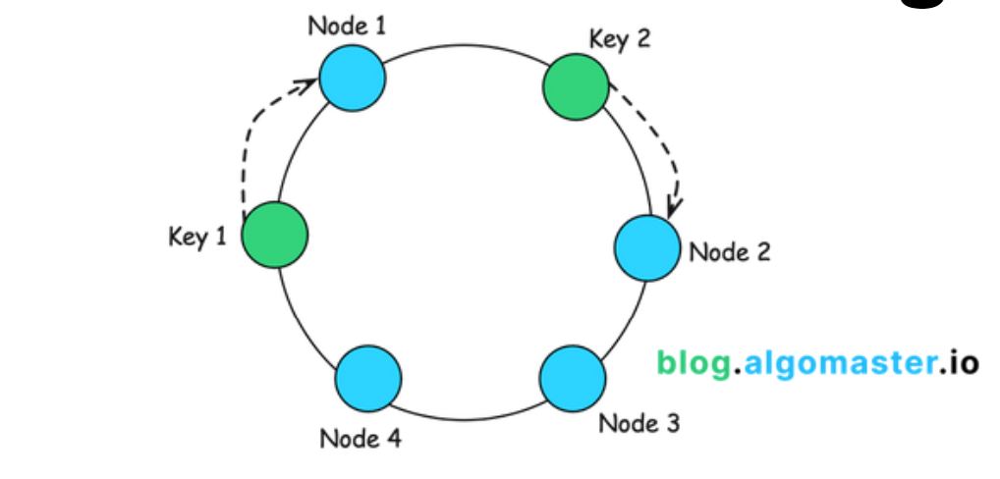

= Consistent hashing

Consistent hashing is a special kind of *[hashing]* technique that allows for *efficient distribution*
of data across a cluster of nodes.

Consistent hashing ensures that only a small portion of the data needs to be reassigned when nodes
are added or removed.

== How it works

1.  *Hash space*: Imaging a fixed circular space or "ring", ranging from 0 to 2^n-1.

2.  *Mapping servers*: Each server is mapped to one or more random points within the hash space,
    using a hash function.

3.  *Mapping data*: Each data item is also mapped to a point within the hash space, using the same
    hash function.

4.  *Data assignment*: A data item is stored on the first server encountered while moving clockwise
    along the hash space ring from the data item's location.
