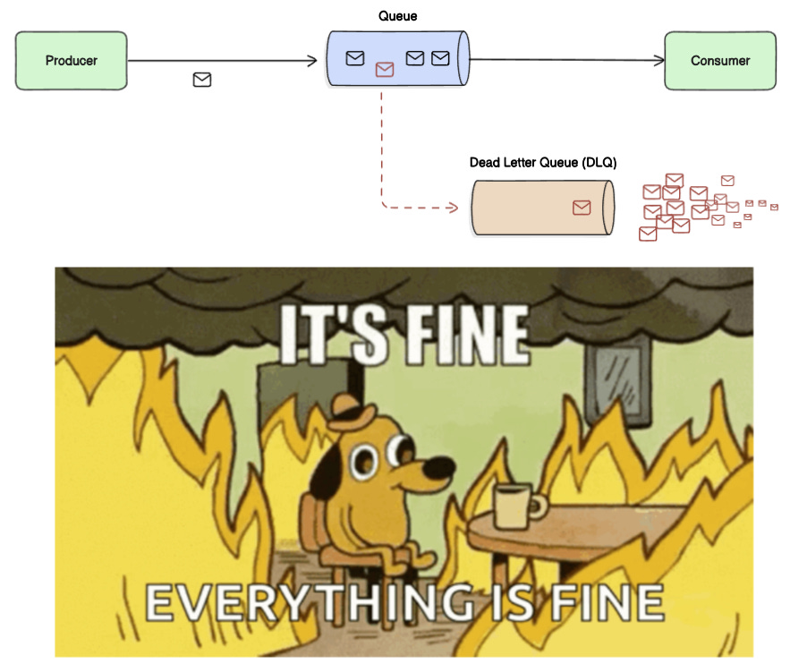

= Dead letter queue

////

Dead Letter Queues (DLQs) are designed to catch messages your system can’t process after a certain number of retries. They’re supposed to give you breathing room. A second chance to act before data is lost.

BUT: Most DLQs are unmonitored.

There’s no alert when messages arrive. No dashboard tracking queue size. No process to investigate what failed and why.

No monitoring = no recovery.

Failures go unnoticed for days or weeks, until someone stumbles across missing data or a downstream report looks off.

By then, it’s often too late.

Fix: Set up metrics for DLQ depth and message age. Trigger alerts when thresholds are breached. Make the DLQ part of your system health dashboard, not a hidden corner.

''''

In systems like AWS SQS, messages in the DLQ are deleted after 14 days.
That’s not configurable.

If no one processes them by then, they’re gone forever.
No reprocessing. No audit trail. No accountability.

Fix: Track the age of DLQ messages. Alert when messages approach the expiration threshold. Set a regular cadence, weekly or even daily, for reviewing and draining DLQs.

////
