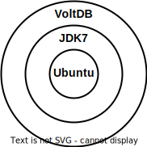

= Docker

Docker is a *link:./container.adoc[container]* technology.

There are two parts to Docker:

* The Docker client application (Docker.exe on Windows).
* The Docker daemon (dockerd.exe on Windows).

The Docker client has a command-line interface (CLI) that allows users to interact with the Docker daemon. A GUI client is also available. The Docker daemon serves a REST API for communication with these and other clients.

The Docker daemon runs the *container engine*, which creates, runs, and manages containers.

https://hub.docker.com/[Docker Hub] is a registry of Docker container images. It gives access to thousands of container images that you can download and run on demand. Other registries are available such as https://www.linuxserver.io/[linuxserver.io] (formerly lscr.io).

== Union filesystem

Docker does something different to most virtualization technologies with its union filesystem.

Imagine you had an Ubuntu image and you wanted to add JDK to that. Using a virtualization technology, you would take the Ubuntu image, run it, install JDK, and then save a new image. With a container system, you would take the Ubuntu image, run it, install JDK, and then save a _diff_ of the image.

Thus, the isolated file system of a container is composed from a hierarchy of layers, starting with the container's base image. Each additional layer represents a different set of changes to the filesystem. It's like an onion – which kind of sounds like "union"!

You can see this whenever you download a container from Docker Hub. You will notice that CLI shows multiple downloads, all of which must complete before the image is available to build from. Each download is an individual layer of the overall image. Docker can reuse both base images and additional layers across different containers. Each layer needs to be downloaded once only, even if shared by multiple containers.

This is a very efficient way of storing images, because you're not storing the whole image every time you make a change. You're just storing the diffs.

[source,Dockerfile]
----
FROM ubuntu:14.04
WORKDIR /root
RUN apt-get install -y default-jdk
CMD /bin/bash
----

[source,sh]
----
docker build -t voltdb/ubuntu-jdk .
----

[source,Dockerfile]
----
FROM voltdb/voltdb
COPY /voltdb /root/voltdb
WORKDIR /root/voltdb
CMD /bin/bash
----

[source,sh]
----
docker build -t voltdb/voltdb .
----
