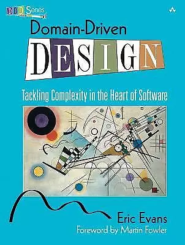
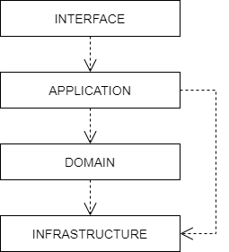
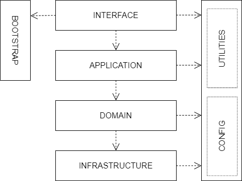

= Domain-driven design (DDD)
:toc: macro
:toclevels: 5

toc::[]

Domain-driven design was popularized by Eric Evans in his 2003 book of the same name, and which is
colloquially referred to as "the blue book". The concepts behind DDD predate the book, but Evans
brought them together into a coherent architectural pattern and design process.

The central idea behind DDD is that good software closely models the human processes that it
automates or the real-world problems that it solves. Domain-driven software designs are built
around models of their *[business domains]* or problem spaces – the subject areas of the software.
The *link:./ubiquitous-language.adoc[language]* used in the domain models is the same as that
used in the real world.

DDD is analogous to physical architecture. Architects design buildings to serve specific functions.
The blueprints for a public library and a private home will therefore look very different.
Domain-driven design takes this principle and applies it to software. Thus, the blueprint for a
banking application should look like the process flows of a bank.

DDD rejects the process of reusing generic architectural patterns like *[model-view-controller]*
and forcing entirely different applications to fit a the same ready-made designs. Instead, a
domain-driven design approach to software involves creating a unique architecture for each
application that is tailored to the specific business domain it serves. So, rather than a system
being composed from a series of functions and procedures, it is built around representations of
things in the real-world problem space.

To design and build high quality domain models, close collaboration is required between the
*technical experts* (who implement the software) and the *domain experts* (aka. subject matter
experts). DDD requires the software delivery teams to work closely with business stakeholders. The
two parties are jointly responsible for iteratively refining the conceptual model of the solution.

DDD is particularly beneficial in complex problem spaces – things like banking applications and
air traffic control systems – or where the business domain is not well understood. The domain-driven
design process helps to clarify the business domain, to identify the key concepts and relationships
within it, and to build a shared understanding of the domain between the technical and business
people.

However, DDD may introduce unnecessary *[accidental complexity]* for small, simple software
systems.

DDD can be described as both an *architectural style*, built around a series of recurring
object-oriented design patterns used for domain modeling , and also a *design process*.

As a software design process, Evans described DDD as having two distinct stages:

* *Strategic design*: You work out what the subdomains are in the business, and the relationships
  between the subdomains.

* *Tactical design*: You refine the domain model, working out what domain objects you will need
  inside each subdomain, and how the subdomain objects interact with each other.

== Strategic design

Although it's possible to apply DDD concepts to an existing application, it is much easier when an
application is built from the ground-up with DDD principles in mind. That's because DDD cuts across
the whole design of an application, forming its broad architectural structure. This is called the
strategic design.

Fundamentally, DDD is all about good *[domain modeling]*. The goal of the strategic design is to
end up with a high-level model, written in computer code, of the business domain. The model is
created by the technical experts but its design is driven by the people who know most about the
domain – the domain experts.

The strategic design is typically developed during a project's *[discovery phase]*. Domains,
subdomains, and key parts are discovered through *[conversations]* with *[domain experts]*. The
technical experts collaborate with the domain experts through continuous conversation and feedback
to create a model of the problem domain that makes sense to all the project's stakeholders. The
goal is for the resulting software to closely map how the business itself thinks and operates.

This is pure business exploration. Methodologies used to discover the domain may include
*Big Picture*, *Process-Level Event Sourcing*, and *Domain Storytelling*. The strategic design is
normally an *[iterative and incremental]* process, because it is normally difficult to create from
the start a complete model that covers all of a business's needs.

The objective of DDD is to produce software that the domain experts would make if they had the
technical know-how to do it themselves.

The emphasis on continuous conversation and close collaboration between technical and non-technical
stakeholders brings other advantages. Often the process of automating business processes through
software development can yield new insights into the business itself. The constant delivery process
brings more insights over time. And it serves the purpose of pooling knowledge within an
organization, such that knowledge of certain aspects of a business and its IT systems are not
restricted to particular tribes within the organization. Instead, knowledge is dissipated throughout
the organization.

=== Domain

The first step in DDD is to define the *domain*. The domain is the subject area of
the software. It is a sphere of knowledge from the real world, processes within which the software
is intended to automate. In the DDD process, domain experts (people who understand the business)
work with developers to define the application's domain.

Examples of application domains include customer relationship management, financial loan application
management, video subscription services, and so on.

Defining the domain is as much about defining what the software will _not_ do as what it _will_ do.
The domain is the boundary within which the software will operate, or the context in which the
software will be used.

=== Subdomains

Once the scope and boundaries of the application are defined in its domain, the second step is to
discover the *subdomains*. A subdomain is a smaller, more specialized area within a domain. Each
subdomain has a specific purpose or represents a particular business capability. For example, in a
video subscription service, the billing, video streaming, and user management areas might be
subdomains.

A subdomain is something that exists in the real world and shows how the
business operates in a given area.

Subdomains may overlap, and they may even be nested. Some processes in a subdomain may be part of
larger processes in another subdomain, which itself touches several other subdomains.

Some subdomains may be *core domains*. In a video subscription service, the core subdomain would
probably be video streaming. DDD emphasizes that the core domain(s) should be the focus of the
design, and the main focus of the project, while *secondary subdomains* should be as simple as
possible and exist only to support the primary ones.

=== Key parts

The third step in the strategic design is to work out what are the *key parts* within each subdomain.
For example, if we look at the billing subdomain in our theoretical video subscription service, we
might identify accounts, payment details, and subscription plans as the key parts of that subdomain.

[plantuml]
....
@startuml
left to right direction
rectangle "video subscriptions" {
  rectangle "billing" {
    rectangle "accounts" {
    }
    rectangle "payment details" {
    }
    rectangle "subscription plans" {
    }
  }
  rectangle "video streaming" {
    rectangle "videos" {
    }
    rectangle "viewers" {
    }
  }
  rectangle "user management" {
    rectangle "subscribers" {
    }
  }
}
@enduml
....

Some key parts will be common across multiple subdomains. For example, subscribers will probably be
a key part in most subdomains. But a sign of good strategic design is when each subdomain has a
few key parts that are unique to it, and are not shared by other subdomains. For example, the
billing subdomain might have a "payment details" part, which you would not expect to see in any
of the other subdomains.

=== Ubiquitous language and bounded contexts

Key parts that are shared between subdomains may not have the same names or labels in each subdomain.
For example, in the billing subdomain, subscribers might be referred to as "accounts", while the
video streaming subdomain might refer to them as "viewers", and the user management subdomain
might use the term "subscribers". Thus, the terms "account", "viewer", and "subscriber" all refer
to the same thing and only the language changes depending on the context.

This is a reflection of the real world, where different parts of a business may use different
terminology to describe essentially the same things.

Clearly, there are significant benefits to having a single unified model covering the whole business
domain. However, especially in complex problem spaces, this is often unrealistic. DDD recognizes
that different subdomains may need to have different models, each with its own distinct terminology.

DDD encourages developers and domain experts to collaborate together and develop a common
*ubiquitous language* to describe the whole business domain, so the same business terms are used
consistently by all the stakeholders. The ubiquitous language, taken from the real world business
domain, will be used to specify requirements, to name things in the application code and tests, and
in all forms of communication (both written and verbal) between the business and technical people.

Where terminology varies, the stakeholders should agree *bounded contexts* within which terminology
is consistent. A bounded context will typically span a single subdomain, but it may span several.
Thus, in most cases, there will be a 1:1 mapping between subdomains and bounded contexts, and
therefore the terms are synonymous. However, in some cases, it may make sense to combine multiple
subdomains into a single bounded context – for example, when two or more subdomains use identical
terminology and have significant interdependencies. Within each bounded context, the stakeholders
should settle on a ubiquitous language for it, in which there is a single term for each concept.

What makes a system complex is not so much the number of subdomains, but rather the number of
bounded contexts. Ideally, a complete system will have a single bounded context, with common
vocabulary and domain objects used everywhere.
But where terminology differs between subdomains (where there are multiple bounded contexts), the
terminology should be translated between the bounded contexts. In code, this is done using
*anti-corruption layers* at the interfaces between subdomains. Each module's user interface is
responsible for ensuring that languages and terms from another context do not pollute the module's
own context.

.Subdomains versus bounded contexts
****
* *Subdomains* help us to understand complex business domains by dividing them into smaller parts.
  They represent real-world business capabilities wrapped into cohesive groups.

* *Bounded contexts* represent independent, unified models, which allow us to transfer knowledge
  from subdomains into our technical solutions.
****

Bounded contexts help to manage *[complexity]*, and are particularly beneficial for managing
accidental complexity that arises through *[evolutionary design]*. For example, imagine that an
insurance business acquires a competitor, and begins the process of integrating their disparate
IT systems. Although the domain is the same (insurance), the two companies will likely have
modeled their domain entirely differently. They will each have developed different business rules,
terminology, and actors. Therefore, rather than try to integrate the two systems into the same
subdomains, it may make sense to keep them separate – at least initially. So you would have a
"Home Insurance" context and a "Health Insurance" context, each with its own ubiquitous language.

Tools such as a https://github.com/ddd-crew/bounded-context-canvas[Bounded Context Canvas] may
be used to help define the bounded contexts and their ubiquitous languages.

=== Context maps

The final part of the strategic design is to learn how the various subdomains interact with each
other. This is about defining the relationships between different parts of the business.

In DDD, this is done by creating a *context map*. This is a visual representation of communication
paths (and directions) between the subdomains.

For example, the video streaming subdomain needs to know what quality of video to stream to the
user, and since this is dependent upon the subscription plans encapsulated in the billing subdomain,
the video streaming subdomain will need to communicate with the billing subdomain. Therefore,
there will need to be a mapping between a viewer in the streaming domain and the subscriber in the
billing domain.

Tools such as the https://contextmapper.org/[Context Mapping DSL (CML)] may be used to model
bounded contexts and to map the relationships between them.

== Tactical design

The strategic design phase of DDD is about mapping out the subdomains within the business domain,
and the relationships between them. With this complete, the design process moves on to defining the
domain objects within each subdomain. This is known as the tactical design.

Whereas the strategic design is very much a _discovery_ process, the tactical design is more of a
technical _design_ process. Another way of thinking about it is that the strategic design
produces a *conceptual architecture* for the solution, while the tactical design fleshes this into
a more detailed *logical architecture*.

DDD provides a set of tactical patterns that can be used to define the domain objects within each
subdomain. The two main tactical patterns are *entities* and *value objects*. Other tactical
patterns in domain-driven design include *aggregates*, *repositories*, and *services*.

Like the ubiquitous language, tactical patterns are scoped to particular bounded contexts. Thus, if
a bounded context is composed or more than one subdomain, the subdomains within that context will
all share the same set of entities, values, and other domain objects.

Many of these constructs will map to the key parts identified in the strategic design.

=== Design patterns

==== Aggregates, entities, and value objects

The domain is modeled using a variety of object-oriented design patterns, notably entities and
value objects, and aggregates of both. Collectively these are known as the *domain objects*.

Domain objects are units of code that encapsulate business rules and data structures that are
taken from the real-world business domain the the software application models. For example, in an
domain with users and teams, the software would probably have a `User` entity and a `Team`
entity, and a `JoinTeam` service which would encapsulate the logic that encodes policies about
which users are allowed to join which teams.

*Entities* are representations of things in the real world, such as subscribers. Each entity has
a unique identifier. Even if two objects have identical properties, they are considered different
entities if they have different IDs.

Entities are mutable. We can change their properties over time – except for their ID. For example,
a subscriber may change their email address, but it's still the same subscriber because its ID
does not change.

*Value objects* are objects that represent a value in a subdomain, such as a date or a price.
Unlike entities, value objects are not unique. Two objects with the same value are considered to be
equal. Value objects are also immutable. If you need to change a value object, you create a new one.

The values of value objects may be considered to be always "correct", since validation is done at
construction of the objects.

Entities may be composed of one or more value objects. For example, a subscriber may have a name,
email address, and date of birth – all of which could be implemented as value objects. You could use
the native types of the programming language to model these values, but by creating value objects
you are explicitly stating that a value is an important part fot he subdomain. By comparison,
implementation details such as the "last modified date" of an entity may not be considered important
enough to be a value object. If the values are not relevant to the business but are required only to
implement the software, we may call these *technical values*.

Whether a piece of data should be modeled as an entity or a value object is not always a clear-cut
decision. For example, an address could be modeled as either (value objects do not have to be
restricted to a single value). In general, if something is important to the business it should be
modeled as an entity. For example, in a real estate application, addresses may be important enough
to be modeled as entities. However, if the address is just a way to contact a customer, it may be
more appropriate to model it as a value object.

You should end up with lots more value objects than entities in your domain model.

The final domain object pattern is the aggregate. *Aggregates* are groups of several entities and
value objects. An example could be an order, which would be composed of a customer entity, the
products ordered (also entities), and value objects such as the order total and the shipping
address.

Like entities, aggregates have unique IDs.

An aggregate also forms a *transactional boundary*, which means that whenever changes are made to
an aggregate they should either be committed to or rolled back from a database or other persistence
mechanism. This ensures that aggregates are always in a consistent state.

Aggregates are also responsible for maintaining *business invariance*. These are business rules
that always remain true, no matter what you do to your system. For example, you might have a rule
that an order's total must always be the sum of all the products ordered. You might have another
rule that stops customers from buying more than what is in stock. This comes at a cost; the more
rules that are encoded in aggregates, the more complex they become and they may get slower to
update. So there is sometimes a trade-off to be made between performance and consistency.
Sometimes it might make sense to setup a *corrective policy*, which runs on a regular basis to
either flag or automatically correct anything that might be wrong.

==== Factories

The factory pattern MAY be used to encapsulate the initialization logic for domain objects –
entities and aggregates.

==== Services

Services contain business logic that does not neatly fit into a single aggregate, or which spans
multiple aggregates.

==== Repositories

Repositories are abstractions of the persistence layers of a system – usually databases. The
purpose of this design pattern is to hide the implementation details of the underlying persistence
technologies from the high-level application and domain logic.

The values returned from repository objects are normally treated as *[collections]*.

=== Architecture

Systems built around domain-driven design principles have a *[layered architecture*].
Domain-driven software tends to have four main conceptual layers:

The idea is that within each layer are components that change for the same reasons.
Thus, components within the interface layer SHOULD change only when there is a *[change request]*
for how clients – users or other programs – interact with the application, while components within the
infrastructure layer SHOULD change only when there is a change in some external system on which the
application depends.

==== The interface layer

The outermost *interface*, *presentation*, or *UI* layer deals with input and output.

This layer is responsible for interpreting user input commands and presenting the system's
response to the client. This layer defines all the entry points to an application, and typically
includes routing rules, view templates, UI controllers, and middleware.

The interface layer SHOULD NOT have any knowledge of business rules, use cases, persistence
technologies, etc. It should only receive client input (eg. URL parameters) and pass these to the
relevant use case in the application layer.

==== The application layer

The interface layer interacts with the lower *application*, *services*, or *commands* layer.

This layer defines everything that the application does as a series of commands, and message or
event handlers. Overall, the application layer defines all of the *[use cases]* for the application.

The use cases will act on the domain objects and business rules in the domain layer below.
The application layer does not do any processing directly, and it does not hold any state. Rather,
the application layer is a thin layer that delegates to the domain layer below. It is a *[mediator]*
between the interface and domain layers.

==== The domain layer

The *domain* or *business* layer is the foundation of domain-based architecture. It encapsulates
domain objects and services, which together model the business domain. The command and event
handlers in the application layer above tend to map to services in the domain layer, which in
turn act on domain objects – aggregates, entities, value objects.

The domain layer is the most important layer in a domain-based architecture.

==== The infrastructure layer

Where domain objects and services need to fetch data and state from external systems – such as
databases, local file systems, third-party web services, and also system software dependencies –
access to these things is provided via abstractions sitting in the *infrastructure* or *framework*
layer.

This is the lowermost layer of the application architecture, and it's the boundary to all the
external systems on which the application depends. Objects here provide abstract interfaces to
vendor libraries, system software, databases, email transport agents, and so on.

A common feature of this layer is the existence of the *repository* pattern, which is used to
query and persist state stored in external systems such as databases.

==== Other layers

The interface, application, domain, and infrastructure layers are the four main layers of a
domain-based architecture. But additional layers may be added as required.

For example, it is not unusual for applications to require some amount of generic bootstrapping
code, environment-specific configuration, and access to general-purpose "utility" functions.
These sorts of concerns may be encapsulated in their own layers, and may be used by all other
layers.

==== Boundaries between layers

A key design constraint of domain-driven architecture is that each layer SHOULD only have knowledge
of the layers below it in the hierarchy. Or, to explain it another way software components within
a layer SHOULD be accessed only by components in a layer above it.

The purpose of this constraint is to enforce good *[separation of concerns]*. In particular, it is
important that domain logic does not get scattered throughout a codebase, coupled to parts of the
UI or database queries, for example.

Dependencies MAY skip layers. For example, components in the application layer MAY interact with
both domain objects and abstractions of the infrastructure and other application dependencies.
For example, a command to send a user an email SHOULD exist in the application layer and it MAY
have dependencies on both a `UserEntity` object (from the domain layer) and an `EmailService`
(from the infrastructure layer).

Commonly, domain objects will act on repository instances. Thus, the _interfaces_ of repositories
belong to the domain layer, while the _implementation_ of repositories belongs to the
infrastructure layer. The domain therefore knows only about the methods and parameters accepted
by the repositories, but otherwise the implementation details of the repositories are hidden
from the domain model.

Coupling between adjacent layers MAY be further reduced by implementing *inversion of control*
at the boundaries between layers. Interfaces and adapters are commonly used at the boundaries for
this purpose. The interfaces belong to the layer above, and the adapters to the layer below. The
interfaces define the dependencies required of an object, while the adapters implement those
interfaces.

For example, if the domain layer has a `UserEntity` object that requires instances to be
persisted in a `UserRepository` (defined in the infrastructure layer), the domain layer SHOULD
also define a `UserRepositoryInterface`. It is the interface that gets swapped for a concrete
implementation, in the form of an adapter. The responsibility for mapping interfaces to adapters
may be delegated to an *link:./dependency-injection.adoc[dependency injection container]*.

== References

=== Books

* https://www.amazon.co.uk/dp/0321125215[Domain-Driven Design: Tackling Complexity in the Heart of Software], Eric Evans, 2003
  — aka. "the blue book", the original book on domain-driven design, and which remains the canonical
  reference resource for it.

* https://www.domainlanguage.com/wp-content/uploads/2016/05/DDD_Reference_2015-03.pdf[Domain-Driven Design Reference: Definitions and Pattern Summaries], Eric Evans (2015)
  — Evans published this free PDF as a reference guide to the key DDD concepts.

* https://www.infoq.com/minibooks/domain-driven-design-quickly/[Domain Driven Design Quickly], InfoQ
  — A free digital book from InfoQ – basically a condensed version of Eric Evans' book.

* https://www.amazon.co.uk/dp/0321834577[Implementing Domain-Driven Design], Vaughn Vernon, 2013
  — aka. "the red book".

* https://www.amazon.com/dp/0134434420[Domain-Driven Design Distilled], Vaughn Vernon, 2016
  — Follow-up to "Implementing Domain-Driven Design".

* https://leanpub.com/ddd-in-php[Domain-Driven Design in PHP], Carlos Buenosvinos,
  Christian Soronellas, and Keyvan Akbary
  — Real examples written in PHP showcasing DDD architectural styles. Extended examples, including
  fully-working applications, are available from the https://github.com/dddinphp[book's Github page].

=== Blog posts

* https://www.infoq.com/news/2017/09/evans-ddd-relevant[Domain-driven design even more relevant now], Eric Evans, InfoQ, 2017

* https://www.infoq.com/articles/ddd-in-practice[Domain-driven design and development in practice], Srini Penchikala, InfoQ (2008)

* https://gorodinski.com/blog/2012/04/14/services-in-domain-driven-design-ddd/[Services in domain-driven design], Lev Gorodinski (2012)

* https://www.infoq.com/articles/ddd-evolving-architecture/[Domain-driven design in an evolving architecture], Nik Silver, InfoQ (2008)

* https://blog.fedecarg.com/2009/03/11/domain-driven-design-and-mvc-architectures/[Domain-driven design and MVC architectures], Federico Cargnelutti

* https://www.methodsandtools.com/archive/archive.php?id=97[An introduction to domain-driven design], Dan Haywood, year unknown
  — Encompasses model-driven design, hexagonal architecture, and more.

* https://www.mirkosertic.de/blog/2013/04/domain-driven-design-example/[Domain-driven design example], Mirko Sertic, 2013

=== Other resources

* https://dddcommunity.org/[DDD community]
  — A website and community forum overseen by Eric Evans and Vladimir Gitlevich.

== See also

* *link:./clean-architecture.adoc[Clean architecture]*
* *link:./conways-law.adoc[Conway's Law]*
* *link:./hexagonal-architecture.adoc[Hexagonal architecture]*
* *link:./onion-architecture.adoc[Onion architecture]*
