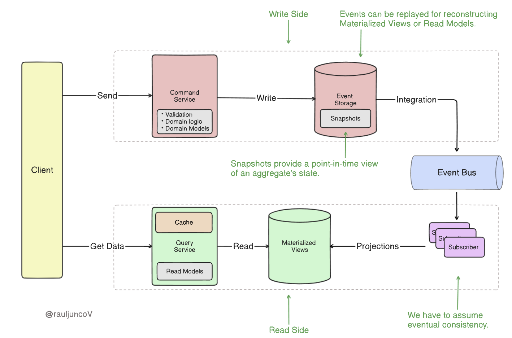

= Event sourcing

Event sourcing is an *[architectural pattern*] in which every change in application state is captured as an *immutable event*. The state of an entity is determined by a sequence of events that are applied to it.

// Event Sourcing is a technique where changes in application state are stored as a sequence of events. Instead of just storing the final state of an entity, the system keeps an immutable record of events that have changed the state of that entity. This not only facilitates auditing and historical tracking of changes but also allows for reconstructing the past state of an entity at any point.

This contrasts with the traditional approach of storing the current state of an entity in a database table, and updating that state with each change. Each change in state simply overwrites the previous state, and the history of changes is not captured.

Event sourcing allows to query the event log, to *replay* past events, and to *reconstruct* past application states. We can even *time travel* back and forth through a system's history to understand how and when things changed.

For example, think about inventory tracking. Instead of updating the inventory count from 200 units to 197 units after an item is shipped, you add an event like `ItemShipped` with a quantity of 3. Each change thus leaves a breadcrumb, and these breadcrumbs collectively tell the story of how the inventory level evolved over time.

Event sourcing has been described as being like giving a system a memory. The system doesn't just know its current state, it also remembers the full history of its state. This can be useful for auditing and debugging, and there are also some interesting possibilities for using this historical data to make predictions about possible futures.

== Key concepts

There are four key concepts in event sourcing:

* *Command*: Represents an action that requests a change in the system. For example, `ShipItem` or `UpdateCustomerAddress`. Commands express _intent_.

* *Event*: The resulting record of a change that has happened, like `ItemShipped` or `CustomerAddressUpdated`. It also records all relevant information needed to reconstruct the system's state. Events are _facts_ and they are immutable.

* *State*: Represents the current condition of an entity, and it is the result of processing all relevant events. Think of it as the latest version of an order or a customer's address, reconstructed by replaying all events that pertain to that entity from the beginning.

* *Command-event separation*: Commands represent intentions to change state, while events represent actual state changes. Commands are processed to generate events, which are then persisted.

****
Commands express intent, events record facts, and state is derived by replaying those events.
****

A key constraint here is that the traditional four *[CRUD]* operations are reduced to just two. In an event sourcing architecture, you cannot use destructive operations (update or delete). You can only create and read things.

== Example

Imagine you need to add inventory to your system. You start by issuing a command like "add 200 units to Product A". This command represents _intent_ to add inventory but it doesn't itself change the state. Instead, the command is processed, validated, and transformed into an event.

This separation ensures that the intent and the actual change are clearly distinct.

After processing the command, the system generates an event like `ItemsReceived +200`. This event is the factual record of the action. Events are immutable, meaning you cannot change them once they are record. The event gets added to the event log, preserving a precise sequence of actions like `ItemCreated`, `ItemsReceived +200`, and `ItemsShipped -3`.

The event log is the heart of the event sourcing architecture. It stores each event as it happened, creating a historical record of all changes. This log allows you to see what happened at each point in time, providing complete traceability.

The current state of the system is derived by replaying all the relevant events. To determine the current inventory count for Product A, you start from an initial state of zero, then replay `ItemsReceived +200` followed by `ItemsShipped -3` to arrive at the current item count of 197 units. The state represents the latest version of an entity and is always reconstructed by processing all past events.

== The read problem

The main challenge in event sourcing architecture is optimizing for read operations. Replaying all events to reconstruct the current state can be computationally expensive, especially as the number of events grows. This calculation needs to be done every time you need to read the current state of an entity.

There are four main strategies to resolve the reading problem:

* *Snapshots*: Snapshots provide a point-in-time view of an aggregate's state. Using snapshots, the system only needs to replay events that have occurred after the snapshot, significantly reducing the computational load.

* *Projections*: Projections create pre-computed views of the data optimized for specific read patterns. They're updated in real-time as new events occur, allowing for fast reads without replaying events.

* *Caching*: Implementing caching strategies can help reduce the need to reconstruct the state from events for frequently-accessed data.

* *Command Query Responsibility Segregation (CQRS)*: This pattern separates the read and write models. The write model uses event sourcing, while the read model can be optimized for queries (often using projections).

== Trade-offs

An event sourcing architecture is beneficial where there is a business requirement to preserve an accurate history of data changes, for example for the purpose of fraud prevention or auditing.

Being able to replay events can also be hugely helpful for debugging issues and incidents.

Historical data can also reveal business insights, such as peak order times and reasons for frequent returns.

Combined with AI and machine learning, event sourcing can also be used to predict future trends based on past events. A system can use the record of "what happened" to predict what might happen next. This sort of combination of technologies could provide benefits in all sorts of areas. It could potentially help to improve fraud detection algorithms, to predict future behavior of customers (eg. predict which customers are most likely to close their accounts), and to optimize stock inventory levels, and so on.

Event sourcing comes with some costs and challenges. Storage and computation costs tend to be higher than conventional CRUD-based systems. There is added complexity in system design, and higher maintenance costs, for example in terms of managing event schemas and versioning. And event sourcing tends to lead to *eventual consistency* across replicated data, so additional mechanisms may be required where data consistency is required.

== See also

* *link:./domain-driven-design.adoc[Domain-driven design]*
* *link:./command-query-responsibility-segregation.adoc[Command Query Responsibility Segregation (CQRS)]*
