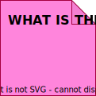

= Event storming

Event storming is a *[workshop]* format for exploring complex business domains. It was created by Alberto Brandolini and promoted in his LeanPub book https://leanpub.com/introducing_eventstorming[Introducing EventStorming], the first draft of which was published in 2021.

It complements *link:./domain-driven-design.adoc[domain-driven design]* and other *[domain modelling]* techniques.

The focus of event storming is on the modeling of events – changes in state over time – rather than the static structures – of code and data – of an IT solution.

Experts from the business domain are invited to participate in event storming workshops, in collaboration with developers and architects, etc. The goal is to build a shared understanding of the business domain, and to identify areas where the business domain is not well understood. Often, no one person has complete knowledge of all the business processes.

The objective of event storming sessions is to build a shared understanding of the business domain. It is NOT to converge on a decision. It is about exploring the problem space, not making decisions in the solution space.

The business domain experts should be encouraged to lead the conversations, and the technical experts should not divert the conversations into technical solution design.

It helps to anchor event storming decisions in concrete business examples, like purchasing a particular example online. Keep it real and concrete, rather than generic and abstract. Drill into the details – they matter.

The core idea behind  event storming is that you place events on a timeline.

An event is a *[domain event]* – something relevant to domain experts. It is represented as an orange sticky note, and labelled using a verb in the past tense – to indicate that the event has already happened. Some events will be time-based, such as "End of month". Some events may be triggered by other events. For example, "Billable amount calculated" is triggered by an "End of month" event, and in turn triggers a "Billable amount verified" event.

image::./_/event-storming-domain-event.drawio.svg[]

There are different types of domain events – "species of domain events":

* The most common type of domain event is some kind of *step in a business process*, eg. "Customer order submitted", "Customer paid $100", "Order completed", "Order shipped".

* Another common type of domain event is *something that happens on a scheduled basis*, eg. "End of month", "Nightly account reconciliation completed".

* Events can trigger other events, when *something meaningful happens as a result of something else happening*, eg. "Customer account locked after invalid password entered three times".

The events are placed in chronological order, on some kind of modeling surface – which could just be a wall! You start by placing a single event on the board, and from there you ask: "What happened before this event?" and "What happened after this event?". And you keep going, building up a timeline of events.

Pink sticky notes are used to capture *the stuff you don't know* – any:

* Questions
* Risks / warnings
* Assumptions
* Conversation points

The pink stickies represent potential problems and risks – the *hotspots*. Follow-up sessions might be needed to try to turn the hotspots into a valid model. But sometimes the solution is not to write any software for that part of the process at all, but rather to look at the process itself and ask: "How could this be improved?"

Yellow stickies represent a type of *user* or *[persona]*, someone fulfilling a particular role in the business domain. When that user interacts with the system, issuing a command to the system, we represent that command using a blue sticky. Commands typically lead to one or more events – especially if you are using some kind of event-based architecture.

image::./_/event-storming-users-commands.drawio.svg[]

Green stickies are used to represent *read models*, or any kind of data that a user would be interested in to make a decision on which commands to issue to the system. When we add a green sticky to the board, we ask ourselves: _The user is going to make a decision, so what information do we need to present to them to allow them to do that?_

If you're working in some kind of event-based or pure functional architecture, then the green stickies tend to take the form of some kind of *projection*.

So, domain events can be triggered by actions taken by users, or they can be triggered by other events in a sequence of events. Domain events can also be triggered simply as a result of time passing. For example, if no action is performed on an entity after a period of time, this would trigger an event from some kind of batch process or scheduling system.

There is a fourth type of trigger for domain events, and that is input from an external system. This could be a system that is internal to the organization, but is external to the application you're working on. This type of trigger is represented by a lilac or purple color sticky note.

.Triggers for domain events
image::./_/event-storming-event-triggers.drawio.svg[]

No events should be left "dangling". Every event should be triggered by something, even if that's just another event.

Modelling all the triggers for domain events helps to define the boundaries of the domain model, and the scope of the system you are designing and building. It can also help to identify *business rules*. If you ever hear someone in an event storming session say "Whenever this happens, we need to do this...", it's a *policy*. For example, "Whenever the total value of a shopping basket exceeds a certain amount, we apply our bulk discount policy". This is a policy that is leading to a command, which in turn triggers a sequence of events. The policy can be captured in a lilac-color sticky.

''''

== Related links

* https://leanpub.com/introducing_eventstorming[Introducing EventStorming] by Alberto Brandolini (2021)

* https://www.oreilly.com/library/view/gamestorming/9781449391195/[Gamestorming] by Dave Gray, Sunni Brown, and James Macanufo (2010)
