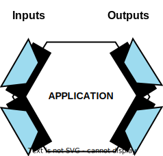
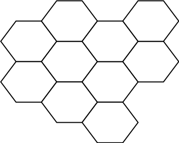

= Hexagonal architecture

:link-hexagonal-arch: https://alistair.cockburn.us/hexagonal-architecture/

{link-hexagonal-arch}[Hexagonal architecture] is a software architectural design pattern devised
by Alistair Cockburn. Conceptually, it is very similar to *[onion architecture]* and
*[clean architecture]*.

Hexagonal architecture is defined as a system that uses *link:./ports-and-adapters.adoc[ports and adapters]*
to model _all_ inputs to, and _all_ outputs from, _all_ the components of a system. The
ports-and-adapters pattern is thus used for _every_ interface that an application has with the
outside world – both its inputs and outputs.

An application will typically have many different inputs and outputs.

The choice of a hexagonal shape to represent this architectural concept is arbitrary. It's just a
nice shape to represent you've got lots of different types of inputs on the "driving" side of the
application, and lots of different types of outputs on the other "driven" side. In the context
of distributed systems or modular monoliths, multiple services or components may interface with
each other through connections made via their ports (using adapters), so the whole system forms
a honeycomb pattern.

The conceptual design of a software system as a pattern of interlocking hexagons dovetails nicely
with *[service-oriented architecture]* (each hexagon could map to a service) and
*[domain-driven design]* (each hexagon could map to a subdomain).

== Pros and cons of hexagonal architecture

[quote, Alistair Cockburn]
____
Allow an application to equally be driven by users, programs, automated test or batch scripts, and
to be developed and tested in isolation from its eventual run-time devices and databases.
____

One of the main advantages of hexagonal architecture is *testability*. Because all dependencies are
hidden behind abstractions by design, it makes it very easy to mock external systems, including
GUIs. All you need to do is create special mock adapters that fit the same ports as the real
adapters.

Another benefit is *evolvability* (aka changeability). For example, it becomes possible to change
from a human-driven use of an application to batch-driven use. You just plugin different adapters
to the existing ports. Likewise, it is relatively easy to change implementations. For example,
you can migrate from MySQL to PostgreSQL by changing the database adapter.

For the same reason, applications become less tightly coupled to any particular infrastructure
or host environment. Thus, applications are more *portable.*

[IMPORTANT]
======
For the ports-and-adapters pattern to effectively deliver these promised benefits, it is important
that business logic does not leak into ports-and-adapters layer. This is the same constraint as for
n-tier architecture, in which business logic should not leak into either the uppermost UI/presentation
layer or the bottommost persistence layer.
======

The main trade-off is that hexagonal architecture adds a lot of *complexity* to your code. There is
more code to maintain, and potentially more effort involved in running applications in development
and other environments. This additional complexity may not be worthwhile for small, trivial
applications.

.References
****

* https://alistair.cockburn.us/Hexagonal+architecture[Hexagonal Architecture], Alistair Cockburn (2005) —
  This article originally defined the hexagonal architecture (aka. ports-and-adapters) patterns.

* https://jmgarridopaz.github.io/content/articles.html[Hexagonal Me] —
  A series of articles by Juan Manuel Garrido de Paz that delves much deeper into this
  architectural pattern, including interview transcripts with Alistair Cockburn.

* https://carlosbuenosvinos.com/hexagonal-architecture-with-php-was-published-in-phparch-magazine/[Hexagonal Architecture with PHP], by Carlos Buenosvinos, published https://www.phparch.com/2014/07/july-2014-phparchitect-magazine-released-navigating-the-business/[in php[arch] in June 2014].

* https://www.thoughtworks.com/en-gb/insights/blog/architecture/demystify-software-architecture-patterns[Demystifying software architecture patterns] — Thoughtworks article that explains the differences between clean, onion, and hexagonal architecture.

****
