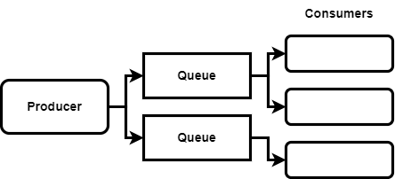

= Kafka

* https://kafka.apache.org/[Kafka] — Official website.
* https://www.warpstream.com/[WarpStream] — Kafka-as-a-service.

// TODO: https://blog.bytebytego.com/p/how-linkedin-customizes-its-7-trillion

Kafka is a distributed streaming platform that is used for building real-time data pipelines and streaming applications. It is horizontally scalable, fault-tolerant, and extremely fast.

In Kafka, all message routing is handled by a *producer*. A Kafka setup can consist of multiple *queues*, organized into multiple *topics* and *partitions*. The producer is solely responsible for determining which queue its data should be added to. This has the advantage of the Kafka cluster itself not having to do a lot of work, which is part of Kafka's design that allows it to handle such high *[throughput]*.

On the producer side, we're able to send messages to one or many queues, based on properties of each message. If we have a situation where we don't want to *fan out*, and instead we want to have multiple partitions and multiple consumers that each get one message, we can do that as well on the producer side, by having the producer hash the message to determine which partition it goes into. This also enables us to scale our Kafka cluster better, because there's no single point where all messages have to go through to be routed.

One of the trade-offs of this design is that, once a message has been produced, we don't have control over where it actually goes.

== Offsets

If something goes wrong and a consumer fails to process a message, we need some way to be able to retry and send the message to a different consumer.

How this is done varies between *[message queues]* and *[stream processing systems]* like Kafka.

In the Kafka model, there is no concept of acknowledgments, instead we have *offsets*. Kafka logs an offset of how many messages each consumer has received so far. Whenever a consumer needs new data, it fetches data from the queue from that offset. Thus, the consumer gets all new data from the last position it read from.

Once the consumer is done processing that batch of data, the consumer then *commits* its offsets back to the queue, effectively telling Kafka that it is done processing that data.

But if a consumer disconnects before it commits it offsets, Kafka will be able to automatically resend the same data to another consumer.

The offset model used by Kafka is good for processing batches of data - ie. large quantities of small events. By comparison, the system of acknowledgements used by RabbitMQ is better when there are a smaller number of long-running tasks.

Kafka's system of offsets can also handle messages being dropped, to some extent.
