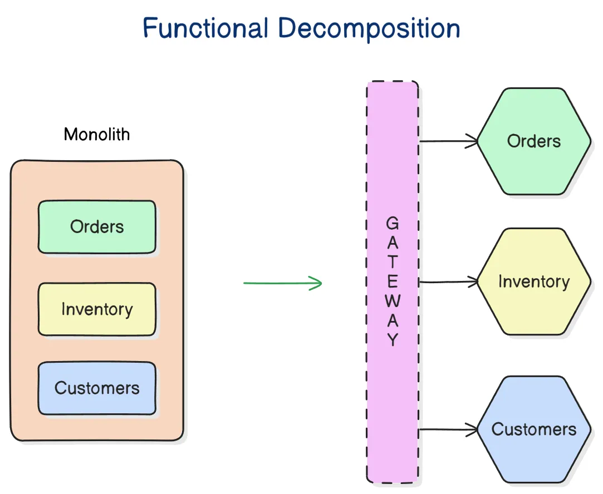

= Microservices (aka. microservice architecture)

// TODO: https://medium.com/hashmapinc/the-what-why-and-how-of-a-microservices-architecture-4179579423a9
// TODO: https://microservices.io/
// TODO: https://blog.allegro.tech/2016/01/microservices-and-macro-mistakes.html
// TODO: https://martinfowler.com/articles/break-monolith-into-microservices.html
// TODO: https://medium.com/hashmapinc/the-what-why-and-how-of-a-microservices-architecture-4179579423a9
// TODO: https://newsletter.systemdesign.one/p/netflix-microservices

The microservice pattern is a subset of *link:./service-oriented-architecture.adoc[service-oriented architecture (SOA)]*.

There is no definitive list of features that distinguish microservices from more general service-oriented designs, but it is widely accepted that the difference is one of granularity. Microservices are typically very small, scoped to a single business function, and independently deployable thanks to maximized *[decoupling]* between services. There also tends to be a bias toward *link:./asynchronous-communication.adoc[asynchronous communication]* between services, particularly indirect *[message-driven]* communication using lightweight messaging protocols, rather than direct service-to-service calls. These constraints do not necessarily apply to service-oriented architecture.

.Microservices vs. SOA
[cols="1,2,2"]
|===
|Characteristic |Microservices |SOA

|*Granularity*
|Fine-grained services, often each with only a single responsibility.
|Mix of fine-grained and coarse-grained services. Some services may have multiple responsibilities.

|*Communication*
|Preference for asynchronous *[messages]* and *[events]*, else lightweight request-response protocols like *[HTTP]*, *[TCP]*, *[UDP]* or *[WebSockets]*.
|May have a higher proportion of direct service-to-service calls, and may use more heavyweight communication protocols like *[SOAP]*.

|*Data*
|Each service manages its own data stores and caching layers.
|Services may share common data stores and caches.

|*State*
|Emphasis on stateless service design.
|Some services may be stateful.

|*Coupling*
|Services are very loosely coupled, with minimal direct dependencies between them. Ideally, individual services will be able to fully process their requests, without needing to call any other service.
|Higher use of direct synchronous communication between services, and possible shared data stores, increases coupling and risks evolution into "distributed monolith".

|*Technology*
|Encourages use of different languages and technology stacks to optimize individual services for their use cases.
|May use a uniform technology stack across all services.

|*Deployment*
|Services are independently deployable and have their own release schedules. Continuous deployment and other modern DevOps practices are fully supported.
|There may be a higher degree of interdependence between services, limiting the "continuous" velocity of deployments. More traditional deployment patterns, eg. scheduled *[release trains]*, are common.

|*Isolation*
|Greater fault tolerance of overall system, due to high degree of isolation of individual services.
|Tight coupling between services increases the fragility of the system as a whole. An error in one service is more likely to cascade into other services.

|*Scalability*
|Individual services have considerable scope for scalability, especially horizontally.
|Larger, more coupled services tend to have more restricted potential to be scaled out.

|*Operations*
|Services are operated by the team that built them.
|May be run by a central operations teams.

|*Team topologies*
|Each service is likely to be fully developed and operated by a single team.
|Multiple teams may be responsible for developing and operating some services.
|===

That final differentiating characteristic – the correlation between microservice architecture and *[team topologies]* – is particularly important. Microservice architecture is designed to solve the problem of how to scale the development and operation of a large, complex system across a very large organization. Traditional organizational structures – for example, where there are separate development and operations teams – tend to buckle under the weight of the communication overhead that comes with managing a large number of subsystems. In the microservices approach, the functional boundaries of microservices map directly to the responsibility boundaries between teams. Because the technical architecture is reflected in the organizational structure, and because each team is responsible for the full lifecycle of the services they own – design, development, testing, deployment, operation, maintenance, and support – then the communication overhead is significantly reduced.

Microservices architecture has been proven to make possible the extreme scalability of software organizations to thousands of people, across hundreds of teams, all while maintaining the delivery speed and agility of a small start-up. This is achieved by composing a system from lots of very small, highly isolated components, each with a single narrowly-scoped responsibility, and with coupling between components all but eliminated. Crucially, each component is the exclusive responsibility of a single team that operates with a high degree of autonomy. Thus, individual services can be changed quickly, not only due to low coupling with other services, but also due to limited requirements for coordination of changes between teams.

With a microservice architecture, *[extreme programming]* practices like *[continuous deployment]* become possible even at enterprise scale. Microservices are a natural fit for the *[DevOps]* model of software development, where development and operations are closely aligned, where a single *link:./cross-functional-teams.adoc[cross-functional team]* is responsible for the end-to-end design, development, testing, deployment, operation, maintenance, and support of a single service – the "you build it, you run it" model.

The term "microservices" originated in the early 2010s and was popularized by thought leaders such as Martin Fowler and James Lewis. Subsequently, the term *[nanoservices]* has been used to describe services that are even more granular than microservices.

== Design trade-offs

A microservice architecture makes the same trade-offs as *link:./service-oriented-architecture.adoc[service-oriented architecture]* and any other *link:./distributed-system.adoc[distributed software]* design. Microservice architecture, due to the high number of services and the high degree of isolation between them, makes these trade-offs more pronounced.

Finer-grained distributed software like microservices are inherently more *link:./complexity.adoc[complex]* than coarser-grained ones – ie. they have higher *accidental complexity*. That's because much of the complexity in distributed software systems is derived from the communication patterns between software components. A system composed from lots of small services is, in principle, more complex than an equivalent system of the same overall size but composed of fewer, larger services. The more granular system design has a higher theoretical limit of interdependencies between its components, and therefore it has a higher potential for complex communication patterns.

image::./_/simple-vs-complex-distributed-systems.svg[]

Due to the potentially high volume of network calls, the choices of *[communication patterns]* and *[inter-process communication]* protocols are critical design decisions in microservices. Best practice in microservices architecture is to reduce, or eliminate entirely, direct service-to-service calls, which would otherwise proliferate with the higher number of services. Microservices tend to go hand-in-hand with *[asynchronous communication patterns]*, with a particular emphasis on *[message-driven]* and especially *[event-driven]* communication via *[message brokers]* or *[event buses]*.

The *[decoupling]* afforded by asynchronous communication patterns brings many other benefits in the context of large-scale microservice systems. It allows for greater scalability, makes it easier to independently deploy individual services, and it improves the *[fault tolerance]* of the overall system by reducing the risk of cascading failures – where one service becomes unavailable, causing a chain reaction of failures into other services.

Microservice design tends to take this principle of *[service isolation]* to extreme levels. For example, a best practice in microservice design is for *[domain services]* to be able to process every request without needing to call any other domain service or utility service. Each service should need only to interact with its own data stores. This design constraint ensures that every request can be fulfilled even if one or more dependency services are *[unavailable]*. *[Points of failure]* are minimized, making for highly *[resilient]* systems. Microservices built within this constraint are also highly *[performant]*, because *[latency]* is minimized in the end-to-end request-response cycle (due to fewer network calls).

This sort of extreme degree of service isolation is achieved by implementing the *[service dependency inversion principle]*: where one service depends on another, rather than *[pulling]* data from the dependency service, the dependency service instead *[pushes]* data to the dependent service, which caches the *[replica data]* ahead of time. Thus, *[temporal coupling]* is reduced and application-level services need only interact with their own data stores to fulfil requests.

The main trade-off of these design choices is that microservices tend to have a high degree of *[data replication]* between services. Because data is shared by replication, and because the synchronization of data tends to be done via *[asynchronous processing]*, then microservices tend to be *[eventually consistent]* rather than *[strongly consistent]*. It is very difficult to achieve strong consistency in distributed systems that are composed from many, many small services that are so isolated from one another that individual services may not even be aware of their own dependencies. Often, it is the strategies put in place to achieve and monitor consistency that is the most significant source of accidental complexity in microservice systems.

To achieve the goal of maximum horizontal scalability, microservices tend to be implemented as *[stateless]* services. In particular, *sticky sessions* – also known as session persistence, which is a *[load balancing]* mechanism in which a user's requests are consistently directed to the same service instances during a session – are avoided. Microservices design emphasizes that every client-server interaction throughout the system should be stateless, with the client responsible for providing all the user state that is required for the server to process the request. This means that no services are required to persist user state between requests.

Besides being highly scalable – due to the ease of replicating services and distributing traffic across multiple instances – this design constraint also improves *[fault tolerance]* because load balancers can also operate as *[failover]* systems, redistributing traffic to available instances when others are unavailable. (Load balancers themselves become *[single points of failure]*, which can be solved by *[clustering]* primary and failover load balancers.)

In extreme implementations, microservices become *disposable*, meaning that individual instances of services can be quickly and cheaply created, started, stopped, and destroyed – without any loss of data, state, or performance. This is a key design principle in *[cloud-native computing]*, where the runtime environments – the cloud infrastructure, based on *[virtualization]* and *[containerization]* technologies – is designed to support the rapid provisioning and decommissioning of services. This opens up all sorts of opportunities for things like the design of *[deployment pipelines]*. It becomes much easier to do things like *[rolling deployments]* – ie. *[continuous delivery]* of lots of *[micro releases]* – and *[auto-recovery]*, for example.

An event-driven, stateless microservice architecture gives us a very scalable, very extensible, and very resilient application platform. Add in a continuous *[deployment pipeline]* and you can do thousands of releases, to hundreds of microservices, without a moment of downtime.

== Challenges in microservices implementation

Microservices have become regarded as a sort of paragon of distributed software design, and a *link:./silver-bullet.adoc[silver bullet]* for solving the problems of large-scale *[software-as-a-service]* development. Microservices were popularized by companies like Amazon, Netflix, and Uber, who adopted this architectural style to solve their unique challenges of delivering planet-scale software-as-a-service solutions. But few organizations have the scalability challenges that microservice architecture is designed to solve. For most organizations, the costs of implementing microservices will likely outweigh the benefits.

The costs of implementing microservices are not trivial – even in the context of cloud infrastructure, which is well-suited to microservices. The costs arise from the additional *[accidental complexity]* associated with the monitoring, orchestration, and operation of a large number of services. The operational overhead of microservices can be significant.

Infrastructure costs can be very high for microservice systems. Although services can be individually *[optimized]* for their specific use cases and traffic patterns, there are many additional technical services to run in production like *[service discovery]*, *[load balancers]*, *[API gateways]*, and *[monitoring]* and *[observability]* tools – which depend on the gathering and real-time processing of large-volume of *[telemetry]* data. In addition, non-production infrastructure to automate testing and deployment can become extensive. *[Cloud infrastructure]* systems, and especially *[public clouds]* which provide many of these features as *[managed services]*, can reduce the costs associated with transitioning to microservice architecture in the short term, while tool such as *[infrastructure as code]* can further reduce the cost of managing such complex infrastructure over the longer term.

But the greater part of the costs of microservices is in the organizational overhead, rather than the running costs of the infrastructure.

The primary aim of a microservice architecture is to eliminate organizational friction by giving individual teams high degrees of autonomy such that they can continuously ship changes. But, ironically, the microservice design can actually _increase_ operational overhead when there is a need to coordinate the implementation and deployment of system-wide changes. The delivery of new user-facing functionality, for example, often requires coordination of development and deployment activities across multiple services. And the more granular the services, the more likely there are to be interdependencies between them.

The communication overhead associated with managing system-wide changes in a microservices system can be significant. Business planning and prioritization can also be more challenging, especially if work such as delivery *[estimations]* need to be gathered from multiple teams.

Managing internal breaking API changes also requires careful coordination. Well-defined, versioned *[service contracts]*, specified using a formal *[interface definition language (IDL)]*, become essential design constraints in microservice systems. This requires centralization of some design decisions, which can be at odds with the goal of decentralizing decision making to the team level. In reality, then, one of the widely-touted benefits of microservices – *[team autonomy]* – is not often achieved. Nevertheless, *[API gateways]* and *[service registries]*, and *[API management]* tools, can all help to manage this aspect of microservice complexity.

Microservices lend themselves well to *[api-first design]*. They also need to be designed to support *[evolvability]*. A service's API invariably will change over time. In a monolithic application it is usually a straightforward matter of changing the API and updating all the callers. In a distributed system like microservices, it is a lot more difficult. Such changes must be orchestrated in an incremental, non-breaking way. You usually cannot force all clients to upgrade in lockstep with the service, so you must incrementally deploy new versions of a service such that both old and new versions run simultaneously. This is known as *[backward compatibility]*. See also the *[robustness principle]*.

Due to all the *[inherent complexity]* of microservice architectures, sophisticated testing, deployment, and monitoring strategies are required. *[Integration testing]* is particularly challenging, and tends to be dependent upon service *[mocking]*, which reduces confidence in the tests. *[End-to-end]* testing requires a significant investment in infrastructure – to run a complete production replica – and such tests can be slow to run. Advanced testing techniques like *[chaos engineering (aka. chaos testing)]* may be necessary in very large scale and mission critical systems.

Debugging production issues is more difficult, too, because you can't just attach a debugger to a running process if the issue could be in any downstream service. *[Observability]* tools, and especially *[distributed tracing]*, are specifically designed to solve the problem of "it works on my machine" syndrome when debugging highly distributed software like microservices.

But perhaps the biggest challenges in the implementation of microservices are the organizational and cultural changes that are required to support them. Microservices are not just a technical architecture, but a *socio-technical system*. To realize the full benefits of microservices, teams require a high degree of *[autonomy]* over their *[technology choices]*, *[design patterns]*, and *[ways of working]*. This autonomy is necessary to allow individual services to change quickly, but it requires a high degree of *trust* from the organization. For this reason, microservices tend not to work so well in command-and-control organizations, where *[top-down design]* and decision-making is the norm.

Greater flexibility over technical choices within individual services is a benefit at the team level, but *technical sprawl* becomes a risk at the organization level. Additional effort needs to be made on *technical standardization* to maintain system *[cohesion]*, eg. through organization-level *technical standards* and *documentation* of the high-level system design, development of shared code libraries, and additional organizational structures such as *guilds* and *communities of practice*. Organization-level policies such as *[service-level agreements]* and *API versioning* standards will be necessary to ensure that services are built and operated to a consistent standard.

These added requirements increase the range of skills required within an organization – for things like *architecture*, *modeling*, and *technical writing*. All of this is additional organizational overhead, and work that does not directly contribute to delivering *[value]* to users.

*Organizational sprawl* is as much of a risk as technical sprawl. As teams become more specialized and focused on their own services, shared understanding of the whole system reduces. New organization-level procedures will be needed to counter-balance this. For example, *cross-training* schemes may be required to support the transferability of team members between teams, and to reduce risks associated with the *[bus factor]*.

A microservice architecture may even have implications for recruitment strategies. The *[two-pizza team]* model, where teams are small enough that they can be fed with two (large) pizzas, is often cited as an effective team size for microservice teams. But given the breadth of responsibilities that are placed on microservice teams, this constraint means that individual team members shoulder a lot of responsibilities. For this reason, *generalization* tends to be more sought after in microservice teams than *specialization*. In a microservice team, everyone needs to be able to do a bit of everything. This has further trade-offs, risks, and costs. There are implications for productivity, for example. Specialization tends to increase productivity, while generalization does the opposite. And there are increased risks associated with *burnout* and staff *turnover*.

*[Self-service]* *[cloud infrastructure]* provisioning, *[auto-scaling]* and *[auto-recovery]* mechanisms, and centralized *[DevOps toolchains]*, go some way to reducing the responsibilities placed on individual teams. If a team needs more resources, they self-provision it though centralized tools. One of the most important technical decisions in microservice design is where to draw the line between local and global standardization. Due to the challenges described above, a best practice has emerged that microservice teams work in a very think application layer that is globally-standardized. Hardware (servers, operating systems, databases), communication infrastructure (*[service registry]* and *[service discovery]*, *[message]* and *[event]* handling, *[load balancing]*), operations infrastructure (*[configuration management]*, *[monitoring]* and *[logging]*, *[deployment pipelines]*), and even the application runtime platform (self-service tools, dev and test environments) are all abstracted away and centrally managed – see *[platform engineering]*. Microservice teams have autonomy only over a well-defined range of local standards, such as the implementation of business logic and choices of data storage technologies for their services, for example. Deep global standardization of a microservice system allows for new services to be easily spun-up and rapidly scaled. Cross-cutting concerns such as performance benchmarking and security testing can be managed centrally, and shared *[quality gates]* can help to enforce service level agreements and promote a high level of consistency in design and implementation across the whole system.

In summary, for an organization looking for evolve their systems to microservices, the process is as much about organization change as it is about technical change. For microservices to be effective, the operational model of the organization must change, as well as the technical architecture.

== Transitioning to microservices

Perhaps the most important design decision in microservice architecture, and service-oriented architecture more generally, is where to draw the boundaries between services. What level of granularity do you want to achieve? If you over-fragment a system, the weight of managing a very large number of services will potentially negate the value of having very small, highly decoupled components. If you under-fragment a system, you get fewer of the benefits of microservices.

Getting the balance right from the start is difficult, due to the *[project paradox]*.

A well-regarded approach to implementing microservices in greenfield projects, particularly when functional requirements are volatile or the business domain is not well understood from the start, is to begin with a *link:./modular-monolith.adoc[modular monolith]* and incrementally extract services from it as specific *[scalability]* requirements *[emerge]* over time.

[quote, Martin Fowler]
____
Don't design microservices, extract them.
____

You start with a modular monolith, decomposed around business verticals. Module boundaries map to business units or capabilities, so the system design is based around a *[model of the business domain]*. From that starting point, you can rapidly refactor the modular monolith to optimize the internal communication patterns between modules. The focus here should be on simplifying the system's internal communicaiton patterns, not on decomposing the system into the smallest possible components. Indeed, it may even be desirable for some modules to remain quite large, potentially even spanning multiple subdomains (or a single bounded context).

Once the system design is relatively stable, you can start to extract out services from the modules of the monolith. The *[refactoring]* process of extracting out microservices from a monolith, service-by-service (or, for that matter, refactoring a monolith into clearly-delineated modules), is known as *[functional decomposition]*. This is a much more gradual and less risky approach than starting with microservices from the outset. It means you do not risk *[prematurely optimizing]* the system design for problems that you may not ever have. Also, because it is much easier to *[refactor]* the internal structure of a *[monolith]* than it is to change the structure of distributed software, you can more rapidly iterate a system's domain model and functionality in the early stages of development – exactly the time in a product's lifecycle when requirements are at their most volatile. Development effort can focus on optimization once functional requirements are more stable.

The key principle in this approach is to delay extracting services until the communication patterns between them have already been optimized in the monolith. The danger in hurrying to a microservice design is ending up with a distributed *[ball of mud]*, where services are tightly coupled and have complex communication patterns between them. Monolithic balls of bud can be refactored more easily than distributed ones. If your organization does not have the *[capability maturity]* to build a decent monolith, it will only fail quicker with microservices.

[quote, Hadi Hariri, The Silver Bullet Syndrome – https://www.youtube.com/watch?v=3wyd6J3yjcs]
____
[With microservices you] move from a single ball of mud to orchestrating a lot of shit.
____

In most cases, system designs should not start with a microservice architecture. The one exception is when you know the system will have a large amount of load as soon as production traffic is routed to it, for example if you are replacing a legacy system or hooking into some existing process, for which the traffic patterns are already known. Implementing microservices through incremental decomposition of a monolith can also be an effective method for transitioning away from legacy systems. This approach requires comprehensive *[system (e2e) tests]*, so that you can verify that the system as a whole remains stable.

****
See also the *link:./strangler-fig-pattern.adoc[strangler fig pattern]*, which is an architectural pattern to help with evolving legacy systems into modern architectures and technology stacks.
****

''''

== References

* https://microservices.io/[Microservices.io] — Articles, a glossary of microservice-related terminology and design patterns, and many more resources, curated by Chris Richardson. An excellent starting point to learn about microservice architecture.

* https://martinfowler.com/articles/microservices.html[Microservices: A definition of this new architectural term] — By Martin Fowler and James Lewis. See also https://martinfowler.com/articles/microservice-trade-offs.html[Microservice trade-offs] for a concise summary of the pros and cons of microservice architecture, and Fowler's https://www.youtube.com/watch?v=wgdBVIX9ifA[GOTO 2014 talk] on this subject.

* https://smartbear.com/learn/api-design/microservices/[What are microservices], SmartBear

* https://www.nginx.com/resources/library/microservices-reference-architecture/[Microservices reference architecture], Chris Stetson (2017)

* https://thenewstack.io/ten-commandments-microservices/[10 commandments of microservices], The New Stack (2016)

* https://www.vinaysahni.com/best-practices-for-building-a-microservice-architecture[Best practices for building a microservice architecture], Vinay Sahni

* https://medium.com/@qasimsoomro/building-microservices-using-node-js-with-ddd-cqrs-and-event-sourcing-part-1-of-2-52e0dc3d81df[Building microservices: using Node with DDD, CQRS, and event sourcing], Qasim Soomro (2019)

* https://www.linkedin.com/pulse/designing-scalable-backend-infrastructures-from-scratch-chauhan[Designing scalable backend infrastructures from scratch], Anshul Chauhan

* https://blog.appdynamics.com/engineering/microservices-monoliths-and-self-contained-systems-time-to-break-it-down/[Microservices, monoliths, and self-contained systems] — Appydynamics Engineering

* https://www.sam-solutions.com/blog/microservices-vs-monolithic-real-business-examples/[Microservices vs. monolithic: real business examples] — Sam Solutions

* https://blog.buzachis-aris.com/2014/12/microservices-vs-monolithic-architectures/[Microservices vs monolithic architectures] — Buzachis Aris (2014)

=== Critiques

* https://riak.com/posts/technical/microservices-please-dont/[Microservices - please, don't], Sean Kelly (2016)

* https://www.dwmkerr.com/the-death-of-microservice-madness-in-2018/[The death of microservice madness in 2018], Dave Kerr (2018) — A strong case made why microservices is not a suitable architecture for all but a few very large organizations.

* https://thenewstack.io/beauty-beast-justgivings-microservices-transformation/[Microservices: the good, the bad and the hype], Jennifer Riggins, The New Stack (2017)

* https://blog.philipphauer.de/microservices-nutshell-pros-cons/[Microservices in a nutshell – pros and cons] — Philipp Hauer (2015)

* https://insights.sei.cmu.edu/saturn/2015/11/microservices-beyond-the-hype-what-you-gain-and-what-you-lose.html[Microservices beyond the hype: what you gain and what you lose] — Paulo Merson, SEI Insights (2015)

=== Case studies

* https://zepworks.com/posts/faster-better-cheaper-and-re-architecture/[Faster, cheaper and better: a story of breaking a monolith], Zep Dehpour (2019)

* https://www.youtube.com/watch?v=N1BWMW9NEQc[Airbnb, from monolith to microservices: how to scale your architecture] — Hear from Melanie Cebula, Software Engineer at Airbnb, on how they utilize microservices to scale their architecture.

* https://www.youtube.com/watch?v=57UK46qfBLY[Microservices at Netflix scale: principles, tradeoffs and lessons learned] — A talk by R. Meshenberg given at GOTO 2016.

=== Books

* https://www.amazon.com/gp/product/1491950358[Building Microservices: Designing Fine-Grained Systems] — Sam Newman (2015)

* https://www.nginx.com/resources/library/designing-deploying-microservices/[Designing and Deploying Microservices] — A free ebook, written by Chris Richardson and Floyd Smith on behalf of Nginx. An excellent resource for all involved in building and maintaining microservice-based systems.

* https://www.amazon.com/gp/product/1491965975/[Production-Ready Microservices: Building Standardized Systems Across an Engineering Organization] — Susan J. Fowler (2016)
