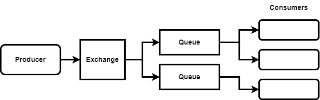

= RabbitMQ

RabbitMQ is a traditional *link:./message-queues.adoc[message queue]* system. It is a good
solution for:

* For long running tasks that take an unknown amount of time to process.

* Where complex routing is involved (see below).

* For sporadic, "bursty" data flow.

== Message routing in RabbitMQ

In RabbitMQ, an *exchange* takes in all of the messages from the producer and routes them to
different queues. The exchange can do things like route messages based on the properties of the
message, and it can also do things like duplicating messages between multiple queues – effectively
*fanning out* messages, similarly to how event streaming systems like Kafka work.

In RabbitMQ, consumers have control over what messages they consume from the queues they are
connected to. So, in a situation where we are not fanning out, this enables us to balance the load
between multiple consumers much better, especially if we are dealing with tasks that have varying
degrees of time associated with them.

== Acknowledgements

If something goes wrong and a consumer fails to process a message, we need some way to be able to
retry and send the message to a different consumer.

How this is done varies between message queues and stream processing systems.

RabbitMQ uses a concept called acknowledgements. Simply, consumers *poll* the queue for new messages,
and when it is finished processing that data it sends an *acknowledgement* back to the queue.
RabbitMQ will wait for an acknowledgment, and if it doesn't receive one in a certain period of time,
then it will resend that data out to another consumer.

This model tends to run better when we have long-running tasks. By comparison, the offset model used
by *[Kafka]* is better when we're processing batches of data - large quantities of small events.
