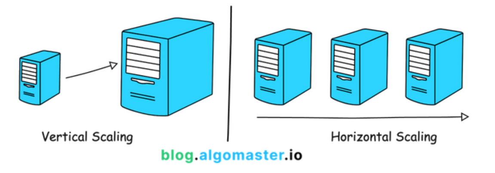

= Scalability

Scalability is a *[quality attribute]* and of an IT system. It refers to the property of a system to handle a growing amount of load – such as more data *[throughput]*, more concurrent users, or more operations and transactions – by adding resources to the system.

A system that can continuously evolve, without major refactoring or re-architecting, to handle a growing workload, is said to be *scalable*.

Scalability is required to maintain *[availability]* and *[performance]* as a system grows in its complexity, usage, and data volume, and so on. Systems that do not have good scalability will tend to exhibit incrementally reduced performance (e.g. increased latency, poor availability, and a drastic increase in the number of incidents and outages) as the system grows.

== Scalability techniques

To scale a system, you essentially have two choices, You can give your nodes more physical resources such as CPU, memory, storage, or network bandwidth. Or you can add more instances of the same nodes, and spread the load between the redundant instances.

These techniques are known as horizontal scaling and vertical scaling. *link:./vertical-scaling.adoc[Vertical scaling]* (aka. *scaling up*) means increasing the capacity of individual nodes, such as using a more powerful server. *link:./horizontal-scaling.adoc[Horizontal scaling]* (aka. *scaling out*) means adding more nodes to a system, such as adding more servers to a server farm.

Horizontal scaling has numerous benefits over vertical scaling. It is often more cost-effective and it also provides other qualities such as better *[fault tolerance]*. There is also a physical limit to how far you can scale vertically, whereas horizontal scalability has a lot more potential for growth — a quality that is known as *elasticity*.

However, it is not always possible to scale horizontally. This is especially difficult to achieve in legacy systems that were not designed to be distributed in the first place.

The following strategies are also relevant:

* *link:./caching.adoc[Caching]*
* *link:./failover.adoc[Failover]*
* *link:./load-balancing.adoc[Load balancing]*
* *link:./preprocessing.adoc[Preprocessing]*
* *link:./replication.adoc[Replication]*
* *link:./sharding.adoc[Sharding]*
