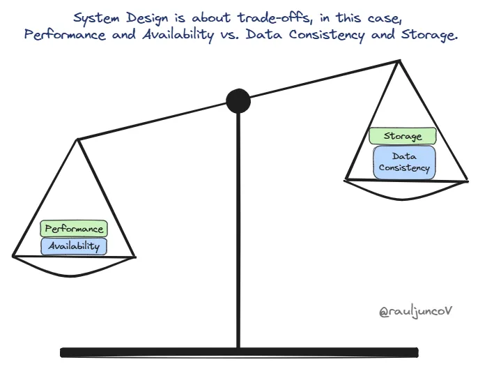

= System design

System design is the process of defining the architecture, interfaces, and data for a system that satisfies specific *[requirements]*.

To meet the needs of an organization, system design requires a systematic approach to building and engineering systems. A good system design requires us to think about everything, from infrastructure all the way down to the data and how it's stored.

== System design trade-offs

.The first law of software architecture
[quote, Mark Richards and Neal Ford, Fundamentals of Software Architecture (O'Reilly)]
____
Everything in software architecture is a trade-off.
____

Much of system design is about making trade-offs between high-level goals and constraints. For example, we might need to prioritize a system being highly *[available]* but less *[consistent]*, or we might need to prioritize consistency over availability.

These sorts of decisions have big impacts on system design, and they are expensive to change later on. *[Evolutionary design]* is best avoided at the highest abstractions of a system. However, it can't always be avoided, due to the *[project paradox]*.

Examples of trade-offs in system design include:

* *Monolithic vs distributed architecture*: +
*[Monolithic systems]* are simpler to develop and deploy, but they can be harder to maintain and they are limited to *[vertical scalability]*. *[Distributed software]* is more complex to develop and deploy, but individual parts are easier to maintain and there is greater scope for scalability using *[horizontal scaling]* techniques. *[Modular monoliths]* provide a middle ground and allow for the incremental transition of a monolith to distributed software.

* *Vertical vs horizontal scaling*: +
*[Vertical scaling]* involves boosting the power of existing nodes (eg. CPI, RAM, storage). *[Horizontal scaling]* involves adding more nodes. Scaling vertically is simpler but there's a physical limit to how much you can upgrade individual nodes, and it maintains a single point of failure. Scaling horizontally is more complicated, and it adds whole new categories of complexity such as those related to achieving *[consistency]*, but it allows for almost limitless scaling.

* *Strong vs eventual consistency*: +
*[Strong consistency]* ensures that any read operation returns the most recent write for a given piece of data. *[Eventual consistency]* ensures that, given enough time, all nodes in a distributed program will converge to the same value (although there are usually no guarantees how long this convergence will take to occur). Strong consistency means that, once a write is acknowledged, all subsequent reads will reflect the value of that write.

* *Stateful vs stateless design*: +
In a *[stateful]* design, the system remembers client data from one request to the next. The server maintains a record of the client's state, which may include session information, transaction details, or any other data relevant to the ongoing interaction. *[Stateless]* design treats each request as an independent transaction. The server does not store any information about the client's state between requests. Therefore, each request must contain all the information necessary for the server to fulfill it.

* *Read-through vs write-through caching*: +
A *[read-through cache]* sits between an application and its data store. When the application requests data, it first checks the cache. If the data is found in the cache (ie. there is a *cache hit*), the cache returns the data to the application. If the data is not found in the cache (ie. there is a *cache miss*), the cache itself is responsible for loading the data from the data store, caching it, and then returning the data to the application. In a *[write-through caching strategy]*, data is written into the cache and the corresponding data store simultaneously. Every write operation writes data to both the cache and the data store. The write operation is considered complete only after the data is successfully written to both the data store and its cache. Other *[caching]* strategies are possible, too.

* *SQL vs NoSQL databases*: +
SQL databases, aka. *[relational databases]*, store data with a predefined schema and allow for complex queries using a structured query language. SQL databases are ideal where complex queries are required to resolve relationships between datasets, where data integrity/validity is required in high-stake transactions such as financial systems (ACID compliance), and where the data is highly structured and that structure is unlikely to change significantly over time. *[NoSQL databases]* are more flexible and scalable. They are best for *[big data]* (the handling of large volumes of both structured and unstructured data), rapid development (because their schema-less nature allows for quicker iterations in data design), and scalability (they are easier to scale horizontally than relational databases).

* *Normalization vs denormalization*: +
*[Normalization]* is the process of organizing a database to reduce redundancy and improve data integrity. Normalization usually involves dividing a relational database into two or more tables and defining relationships between the tables. *[Denormalization]* is the process of combining data back into fewer tables to improve read/query performance, even if this means adding redundant data to the database. Denormalization may be done in conjunction with a transition to non-relational database systems, and it is typically used to optimize read-heavy operations, where the cost of reading data is more important than the cost of writing and storing it.

* *Synchronous vs asynchronous communication*: +
In *[synchronous processing]*, tasks are executed sequentially, making it easier to reason about the flow of control and handling dependencies. Synchronous processing is used in scenarios where tasks must be completed in a particular order, like reading a file line by line. In *[asynchronous processing]*, tasks are executed concurrently, improving responsiveness and performance. This is used where you need to handle multiple tasks simultaneously without blocking the main thread, like background processing jobs.

* *Batch vs stream processing*: +
In *[batch processing]*, large volumes of data is processed at once, typically at scheduled intervals. It is an efficient way to handle massive datasets, and ideal for tasks like data aggregation, backups, reporting, and data warehousing. The main trade-off is high latency; data is available only after the entire batch is processed. *[Stream processing]* tends to be used to process data in real-time (as it arrives). It is ideal for real-time analytics, monitoring and alerting. Other common use cases for stream processing include fraud prevention, live data feeds, and IoT applications. The main advantages of stream processing over batch processing is its low latency, since data is processed within milliseconds of its arrival (usually).

* *TCP vs UDP*: +
When it comes to data transmission over the internet, two key protocols are at the forefront: TCP and UDP. *[TCP (Transmission Control Protocol)]* is the more reliable (it ensures all data packets arrived in order and are error-free), connection-oriented (it establishes a connection before data transfer, making it ideal for tasks where accuracy is crucial - eg. web browsing, file transfers), but it is slower (due to the overhead of managing connections and ensuring reliability can introduce latency). *[UDP (User Datagram Protocol)]* is faster (it has minimal overhead, allowing for quick data transfer, making it perfect for time-sensitive applications like video streaming, VoIP, and online gaming), connection-less (there is no formal connection setup; data is sent without guarantees), but it is less reliable (there is no error checking or ordering, so some data packets may be lost or arrive out of order).

* *REST vs RPC-style APIs*: +
When designing client-server APIs, two popular architectural styles often come into consideration: REST and RPC. The *[REST (Representational State Transfer)]* style is based on the semantics of HTTP, and is often implemented using HTTP. Key characteristics of REST-style APIs include statelessness (each request contains all necessary information for the server to fulfill it), resource-based (it uses URLs to represent resources), using standards HTTP methods (GET, POST, PUT, DELETE), and it typically returns data in JSON or XML format. *[RPC (Remote Procedure Call)]*-style APIs are action-based, ie. they are focused on operations or actions. RPC-style APIs tend to be implemented in a wider range of protocols, including HTTP but also others like gRPC, Thrift, and SOAP. RPC-style APIs often use custom methods and custom data formats.

* *Push vs pull-based client-server communication*: +
In a *[push-based]* system, the server sends data to the client without the client requesting it. This is ideal for applications like stock tickers, where unidirectional server-to-client real-time data updates are a requirement. In web application, *[webhooks]* is one possible technique for implementing a push-based notification system. In *[pull-based]* communication, the client requests data from the server when it needs it. This is ideal for scenarios where the client needs control over when it syncs its state with the server.

* *Bidirectional vs unidirectional protocols*: +
A related decision is whether to use a bidirectional or unidirectional protocol for client-server communication. *[Bidirectional]* protocols like *[WebSockets]* establish persistent connections between the client and server, allowing for real-time exchange of data between the client and server, and vice versa – the server can also _push_ data to the client without the client explicitly requesting it. *[Unidirectional]* protocols like *[HTTP]* require the client to make a request to the server for each piece of data it needs, which can be less efficient for real-time applications. *[Long-polling]* is a technique to mimic bidirectional communication over unidirectional protocols. This has costs such as increased server load, but it can be an optimum design solution in some specific use cases.

== Related topics

* *link:./bottom-up-design.adoc[Bottom-up design]*
* *link:./distributed-system.adoc[Distributed system]*
* *link:./scalability.adoc[Scalability]*
* *link:./top-down-design.adoc[Top-down design]*
